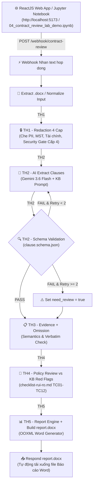

# Hướng dẫn thực hành Buổi 04: Thẩm định hợp đồng tự động (Contract Review Agent)

> File dành cho HỌC VIÊN (sync sang `studentkit/`). Đáp án/expected ở `checkpoints/` (🔒 instructor-only).  
> Khóa AI Automation & Vibe Coding K1 · GV: Lộc · 120 phút · HV: vận hành/pháp lý/kỹ thuật phi-code.  
> **Tool chính: n8n (npx) Auto-Config & Jupyter Interactive Notebook** (`test/04_contract_review_lab_demo.ipynb`) & **ReactJS Web App Legal AI Guard** (`app/`).  
> **Phương pháp giảng dạy**: **Tự động cấu hình 1-Click Workflow vào npx n8n**, không mất thời gian kéo-thả cấu hình từ đầu; tập trung vào **DEMO trực quan, vận hành end-user** và giải thích các nguyên tắc cốt lõi: Harness Engineering (schema+evidence) + Determinism (JS/Python) + Redaction (che PII 4 cấp) + Kho tri thức Red Flag (`checklist-rui-ro.md`).

---

## 1. Mục tiêu buổi học

### 🎯 Mục tiêu tổng quát

#### 🧠 1. Mục tiêu về tư duy (Mindset)
- **Tư duy "Vận hành & Demo 1-Click"**: Tập trung trải nghiệm cách hệ thống tự động hóa thẩm định hợp đồng hoạt động thực tế (kết hợp n8n Webhook và ReactJS Web App) thay vì mất thời gian thao tác cài đặt từng Node thủ công.
- **Tư duy "Kiểm chứng AI qua Harness"**: Chuyển dịch từ việc "tin tưởng AI" sang tư duy coi AI chỉ là bên đề xuất (*proposal*), còn hệ thống kiểm thử (**Harness Engineering**) mới là cổng phê duyệt dữ liệu.
- **Tư duy Tất định (Determinism)**: Nhận thức tầm quan trọng của việc giao các logic cốt lõi (schema check, string matching, tính điểm rủi ro, render báo cáo OOXML) cho Code Node xử lý để xóa bỏ biến thiên ngẫu nhiên của LLM.
- **Tư duy Bảo mật dữ liệu nguồn (Data Privacy First)**: Thấm nhuần nguyên tắc che thông tin 4 cấp (Redaction) để bảo vệ PII, tài chính và bí mật kinh doanh trước khi gửi dữ liệu sang AI Cloud.
- **Tư duy Quản trị Kho tri thức số hóa (Knowledge Base First)**: Chuyển đổi bộ quy tắc rà soát & dấu hiệu *Red Flag* của doanh nghiệp thành file dữ liệu dạng Kho tri thức (`checklist-rui-ro.md`) để AI/Python đối chiếu chuẩn xác thay vì phán đoán cảm tính.

#### 🛠️ 2. Mục tiêu về kỹ năng (Skills)
- **Tự động cấu hình & Vận hành n8n (npx) Workflow**: Sử dụng lệnh 1-click hoặc `auto_import_n8n.py` để nạp tự động toàn bộ n8n workflow (`checkpoints/n8n-contract-review-solution.json`) vào môi trường npx n8n local (`http://localhost:5678`).
- **Demo & Trải nghiệm Step-by-Step qua Jupyter Notebook**: Sử dụng file [04_contract_review_lab_demo.ipynb](file:///Users/shimazu/Documents/9.%20active/alobase/course_ai_automation/giao_trinh/giang-day/05-thuc-hanh/04-contract-review/test/04_contract_review_lab_demo.ipynb) (từ Step 0 đến Step 6) để vận hành trực quan từng bước trong lab từ góc độ người dùng vận hành cuối (End-User Operator).
- **Vận hành giao diện Web App Vibe Code (ReactJS - Legal AI Guard)**: Trải nghiệm ứng dụng Web App (`http://localhost:5173`) kết nối trực tiếp với n8n Webhook (`/webhook/contract-review`), nạp hợp đồng thô và nhận về Báo cáo Word.
- **Vận hành Redaction 4 cấp**: Trải nghiệm quá trình che 100% PII (email, SĐT), mã số thuế, giá trị tài chính, đại diện pháp lý và kiểm tra Security Gate Level 4 (STOP if secret).
- **Kiểm soát bóc tách qua Schema & Evidence**: Quan sát cách Harness tự động từ chối dữ liệu thiếu `verbatim_quote` hoặc sai schema (kèm vòng lặp Retry), đồng thời đối chiếu nguyên văn để phát hiện AI bịa thông tin (*hallucination*) và bỏ sót điều khoản (*omission*).
- **Tự động xuất Báo cáo Thẩm định Word (`report.docx`)**: Theo dõi quá trình Node Report Engine tự động tính điểm rủi ro (Contract Risk Score 0-100), phân loại bằng Emoji (🔴/🟡/💡) và render file Word OOXML chuẩn Nghị định 30 có khung ký duyệt HITL.

---

## 2. Phương pháp Cấu hình Tự động & Vận hành Demo

### ⚡ 1. Tự động cấu hình Workflow vào npx n8n (Không làm thủ công)
Học viên và Giảng viên **KHÔNG cần tạo thủ công từng Node**. Toàn bộ workflow đã được đóng gói sẵn và tự động cấu hình:

```bash
# Di chuyển vào thư mục test và khởi chạy n8n (Tự động import Workflow solution v4)
cd test
python3 auto_import_n8n.py
```
> 💡 **Kết quả**: Truy cập `http://localhost:5678` (Email: `admin@alobase.vn` | Pass: `Password123!`), workflow **"B4 K1 - Contract Review Agent (Webhook text + Report DOCX) - v4"** đã sẵn sàng hoạt động ngay lập tức!

### 📓 2. Chạy Demo từng bước bằng Jupyter Notebook
Mở file Jupyter Notebook [`test/04_contract_review_lab_demo.ipynb`](file:///Users/shimazu/Documents/9.%20active/alobase/course_ai_automation/giao_trinh/giang-day/05-thuc-hanh/04-contract-review/test/04_contract_review_lab_demo.ipynb) trên VS Code hoặc Jupyter Lab. Notebook này đóng vai trò giao diện vận hành trực quan từng bước:

1. **Step 0**: Auto-Launch & Auto-Config n8n Workflow (`npx n8n start` / `python3 auto_import_n8n.py`) & REST API Login.
2. **Step 1**: Chạy & Trải nghiệm Ứng dụng Web App Vibe Code ReactJS (`http://localhost:5173`).
3. **Step 2**: Nạp & Đọc Hợp đồng Đầu vào (`contract-mau-hop-dong-dich-vu.docx`).
4. **Step 3**: Vận hành Node Redaction 4 Cấp Bảo mật PII trên n8n (`TH1 - Redaction 4 Cap`).
5. **Step 4**: Vận hành AI Extract (Gemini 3.6 Flash) & Harness Schema Validation Gate trên n8n (`TH2 - Schema Validation (clause.schema.json)`).
6. **Step 5**: Policy Review vs Kho Tri Thức Red Flag (`checklist-rui-ro.md`) & Evidence/Omission Check trên n8n (`TH3 - Evidence + Omission` & `TH4 - Policy Review vs KB Red Flags`).
7. **Step 6**: Vận hành Master Pipeline & Tự động xuất Báo cáo Word trên n8n (`TH5 - Report Engine + Build report.docx`).

---

## 3. Context bài toán & Workflow sử dụng trong buổi học (Example Flow)

### 🏢 Context thực tế bài toán trong doanh nghiệp
Trong các doanh nghiệp vừa và lớn (200–2,000+ nhân sự), bộ phận Pháp chế (Legal) hoặc Vận hành (Operations) phải rà soát từ **50 đến vài trăm hợp đồng/tháng**:
- **Nút thắt cổ chai (Bottleneck)**: Mất **2–3 giờ/hợp đồng** để đọc từng điều khoản và phát hiện bẫy pháp lý.
- **Rủi ro rò rỉ dữ liệu (Privacy Risk)**: Gửi nguyên văn hợp đồng chứa PII & thông tin tài chính lên Cloud vi phạm an toàn thông tin.
- **Rủi ro AI bịa thông tin (Hallucination)**: LLM phán đoán cảm tính, tự bịa điều khoản không có thật.

### 🔄 Sơ đồ luồng xử lý (Workflow Diagram)



---

## 4. Chuẩn bị (HV & GV)

| Item | Số lượng | Link/Path | Mô tả |
|------|---------|-----------|-------|
| n8n (npx) Auto-Config | 1/HV | `test/auto_import_n8n.py` | Script tự động nạp solution workflow `checkpoints/n8n-contract-review-solution.json` vào n8n local |
| Jupyter Demo Notebook | 1/HV | [`test/04_contract_review_lab_demo.ipynb`](file:///Users/shimazu/Documents/9.%20active/alobase/course_ai_automation/giao_trinh/giang-day/05-thuc-hanh/04-contract-review/test/04_contract_review_lab_demo.ipynb) | Notebook demo tương tác từng bước cho Giảng viên & Học viên |
| ReactJS Web App (Legal AI Guard) | 1/HV | `app/` (`http://localhost:5173`) | Giao diện Web App tương tác người dùng nạp hợp đồng & nhận file report.docx |
| Test Runner & Suite | 1/HV | `test/run_e2e_tests.py`, `test/interactive_e2e_runner.py` | Bộ công cụ tự động import & kiểm thử workflow local |
| `templates/contract-mau-hop-dong-dich-vu.docx` | 1/HV | [contract-mau-hop-dong-dich-vu.docx](file:///Users/shimazu/Documents/9.%20active/alobase/course_ai_automation/giao_trinh/giang-day/05-thuc-hanh/04-contract-review/templates/contract-mau-hop-dong-dich-vu.docx) | Mẫu hợp đồng chính dùng để demo (8 điều khoản + rủi ro HD03/05/06) |
| `templates/clause.schema.json` | 1/HV | [clause.schema.json](file:///Users/shimazu/Documents/9.%20active/alobase/course_ai_automation/giao_trinh/giang-day/05-thuc-hanh/04-contract-review/templates/clause.schema.json) | JSON Schema validate dữ liệu bóc tách |
| `templates/checklist-rui-ro.md` | 1/HV | [checklist-rui-ro.md](file:///Users/shimazu/Documents/9.%20active/alobase/course_ai_automation/giao_trinh/giang-day/05-thuc-hanh/04-contract-review/templates/checklist-rui-ro.md) | Kho tri thức 12 tiêu chí Red Flag & bẫy hợp đồng |

---

## 5. Chuỗi Bài Tập Thực Hành & Hướng Dẫn Vận Hành Demo

| Bài | Tên bài thực hành | Phương thức thực hiện | Deliverable chính | Link bài hướng dẫn |
|---|---|---|---|---|
| **Thực hành 1** | Cài đặt & Auto-Config n8n (npx) & Web App | `python3 auto_import_n8n.py` & Notebook Step 0-1 | n8n running + Web App Legal AI Guard | 📄 [Hướng dẫn Thực hành 1](./thuc-hanh-1-n8n-setup.md) |
| **Thực hành 2** | Redaction 4 cấp bảo mật PII | Demo trên Notebook Step 3 / Node `TH1 - Redaction 4 Cap` | Bản text Redacted 4 Cấp | 📄 [Hướng dẫn Thực hành 2](./thuc-hanh-2-redaction.md) |
| **Thực hành 3** | Extract & Schema Validation | Demo trên Notebook Step 4 / Node `TH2 - Schema Validation` | JSON `clauses` schema-valid | 📄 [Hướng dẫn Thực hành 3](./thuc-hanh-3-extract-schema.md) |
| **Thực hành 4** | AI Policy Review & Evidence Check | Demo đối chiếu Red Flag & Node `TH3` + `TH4` | `evidence_checked` & `red_flags` | 📄 [Hướng dẫn Thực hành 4](./thuc-hanh-4-ai-review.md) |
| **Thực hành 5** | End-to-End Master Workflow + Report Word | Demo trên Notebook Step 6 / Node `TH5` xuất Word | `report.docx` | 📄 [Hướng dẫn Thực hành 5](./thuc-hanh-5-harness-report.md) |

---

## 6. Tổng kết & Checklist Nghiệm thu (SLI/SLO)

**Deliverable nghiệm thu được:**
- [ ] Auto-Launch npx n8n thành công, workflow tự động nạp tại `http://localhost:5678` (Thực hành 1)
- [ ] Mở ứng dụng ReactJS Web App (`http://localhost:5173`) hoặc Jupyter Notebook [`04_contract_review_lab_demo.ipynb`](file:///Users/shimazu/Documents/9.%20active/alobase/course_ai_automation/giao_trinh/giang-day/05-thuc-hanh/04-contract-review/test/04_contract_review_lab_demo.ipynb) chạy thành công toàn bộ các Cell (Step 0 ➡️ Step 6)
- [ ] `TH1 - Redaction 4 Cap` — 100% PII (Email, SĐT), MST, tài chính, tên đại diện được che, Cấp 4 Security Gate chặn từ khóa tối mật (Thực hành 2)
- [ ] `TH2 - Schema Validation` — Schema Validation PASS, kiểm soát đủ các trường top-level, metadata và clause (Thực hành 3)
- [ ] `TH3 & TH4 Policy Review` — Đối chiếu Kho tri thức Red Flag + bắt đúng bẫy đơn phương gia hạn HD05, bồi thường không giới hạn HD06 & bỏ sót điều khoản TC05 (Thực hành 4)
- [ ] `TH5 Report Engine` — File Word Báo cáo Thẩm định Hợp đồng (`report.docx`) được xuất tự động chứa Contract Risk Score, bảng thiếu điều khoản, bảng red flags, bảng chi tiết & khung ký duyệt HITL (Thực hành 5)
- [ ] Bộ kiểm thử tự động `test/run_e2e_tests.py` báo kết quả **PASSED 8/8 test cases**

---

## 7. Fallback & Checkpoint Index

| TH | Phương án Auto-Import / Fallback | Checkpoint File |
|----|---------------------------------|-----------------|
| Thực hành 1 | Chạy `python3 test/auto_import_n8n.py` | `checkpoints/n8n-contract-review-solution.json` |
| Thực hành 2 | Chạy Step 3 trong Jupyter Notebook | Node `TH1 - Redaction 4 Cap` |
| Thực hành 3 | Chạy Step 4 trong Jupyter Notebook | Node `TH2 - Schema Validation (clause.schema.json)` |
| Thực hành 4 | Chạy Step 5 trong Jupyter Notebook | Node `TH3 - Evidence + Omission` & `TH4 - Policy Review` |
| Thực hành 5 | Chạy Step 6 trong Jupyter Notebook xuất file `report.docx` | Node `TH5 - Report Engine + Build report.docx` |

---

## 8. Grading Rubric — B4 lab (100 pts)

| Criterion | Điểm | Mô tả |
|-----------|------|-------|
| npx n8n & Auto-Config & Web App (Thực hành 1) | 15 | Khởi chạy n8n auto-import workflow `n8n-contract-review-solution.json` & Test Suite PASSED 8/8 |
| Redaction 4 cấp (Thực hành 2) | 15 | Che 100% PII, MST, giá trị hợp đồng, đại diện pháp lý & cổng Security Gate Cấp 4 |
| Schema validation (Thực hành 3) | 20 | Harness Schema Gate tất định (`clause.schema.json`), lặp Retry max 2 khi fail |
| AI Review & Evidence Check (Thực hành 4) | 20 | Review 12 quy tắc Red Flags Policy (`checklist-rui-ro.md`) + bắt đúng Hallucination & Omission |
| Master Workflow & Report Word (Thực hành 5) | 20 | Workflow end-to-end + xuất file Báo cáo Word `report.docx` chuẩn OOXML Nghị định 30 |
| Safety & Control (HITL) | 10 | Kiểm soát an toàn dữ liệu, rule injection, logic tất định Code Node và khung ký duyệt HITL |
| **Total** | **100** | ≥70 = PASS |
