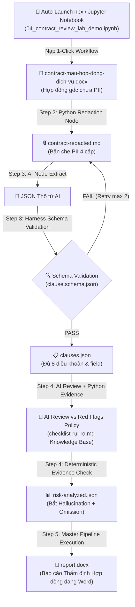

# Hướng dẫn thực hành Buổi 04: Thẩm định hợp đồng tự động (Contract Review Agent)

> File dành cho HỌC VIÊN (sync sang `studentkit/`). Đáp án/expected ở `checkpoints/` (🔒 instructor-only).
> Khóa AI Automation & Vibe Coding K1 · GV: Lộc · 120 phút · HV: vận hành/pháp lý/kỹ thuật phi-code.
> **Tool chính: n8n (npx) Auto-Config & Jupyter Interactive Notebook** (`test/04_contract_review_lab_demo.ipynb`).
> **Phương pháp giảng dạy**: **Tự động cấu hình 1-Click Workflow vào npx n8n**, không mất thời gian kéo-thả cấu hình từ đầu; tập trung vào **DEMO trực quan, vận hành end-user** và giải thích các nguyên tắc cốt lõi: Harness Engineering (schema+evidence) + Determinism (Python) + Redaction (che PII 4 cấp) + Kho tri thức Red Flag (`checklist-rui-ro.md`).

---

## 1. Mục tiêu buổi học

### 🎯 Mục tiêu tổng quát

#### 🧠 1. Mục tiêu về tư duy (Mindset)
- **Tư duy "Vận hành & Demo 1-Click"**: Tập trung trải nghiệm cách hệ thống tự động hóa thẩm định hợp đồng hoạt động thực tế thay vì mất thời gian thao tác cài đặt từng Node thủ công.
- **Tư duy "Kiểm chứng AI qua Harness"**: Chuyển dịch từ việc "tin tưởng AI" sang tư duy coi AI chỉ là bên đề xuất (*proposal*), còn hệ thống kiểm thử (**Harness Engineering**) mới là cổng phê duyệt dữ liệu.
- **Tư duy Tất định (Determinism)**: Nhận thức tầm quan trọng của việc giao các logic cốt lõi (schema check, string matching, tính điểm rủi ro) cho Code Python xử lý để xóa bỏ biến thiên ngẫu nhiên của LLM.
- **Tư duy Bảo mật dữ liệu nguồn (Data Privacy First)**: Thấm nhuần nguyên tắc che thông tin 4 cấp (Redaction) để bảo vệ PII, tài chính và bí mật kinh doanh trước khi gửi dữ liệu sang AI Cloud.
- **Tư duy Quản trị Kho tri thức số hóa (Knowledge Base First)**: Chuyển đổi bộ quy tắc rà soát & dấu hiệu *Red Flag* của doanh nghiệp thành file dữ liệu dạng Kho tri thức (`checklist-rui-ro.md`) để AI/Python đối chiếu chuẩn xác thay vì phán đoán cảm tính.

#### 🛠️ 2. Mục tiêu về kỹ năng (Skills)
- **Tự động cấu hình & Vận hành n8n (npx) Workflow**: Sử dụng lệnh 1-click hoặc npx n8n Compose để nạp tự động toàn bộ n8n workflow (`checkpoints/n8n-contract-review-solution.json`) vào môi trường npx n8n local.
- **Demo & Trải nghiệm Step-by-Step qua Jupyter Notebook**: Sử dụng file [04_contract_review_lab_demo.ipynb](file:///Users/shimazu/Documents/9.%20active/alobase/course_ai_automation/giao_trinh/giang-day/05-thuc-hanh/04-contract-review/test/04_contract_review_lab_demo.ipynb) để đứng ra chạy trực quan từng bước trong lab từ góc độ người dùng vận hành cuối (End-User Operator).
- **Vận hành Redaction 4 cấp**: Trải nghiệm quá trình che 100% PII (email, SĐT), mã số thuế, số tiền tài chính và kiểm tra Security Gate Level 4.
- **Kiểm soát bóc tách qua Schema & Evidence**: Quan sát cách Harness tự động từ chối dữ liệu thiếu `verbatim_quote` hoặc sai schema, đồng thời đối chiếu nguyên văn để phát hiện AI bịa thông tin (*hallucination*) và bỏ sót điều khoản (*omission*).
- **Xuất Báo cáo Thẩm định Word (`report.docx`)**: Theo dõi quá trình hệ thống tự động tổng hợp điểm rủi ro, phân loại bằng Emoji (🔴/🟡/💡) và tạo file Word hoàn chỉnh.

---

## 2. Phương pháp Cấu hình Tự động & Vận hành Demo

### ⚡ 1. Tự động cấu hình Workflow vào npx n8n (Không làm thủ công)
Học viên và Giảng viên **KHÔNG cần tạo thủ công từng Node**. Toàn bộ workflow đã được đóng gói sẵn và tự động cấu hình:

```bash
# Di chuyển vào thư mục test và khởi chạy container n8n (Tự động import Workflow)
cd test
npx n8n start
```
> 💡 **Kết quả**: Truy cập `http://localhost:5678`, workflow **"B4 K1 - Contract Review Agent 4 Lớp"** đã sẵn sàng hoạt động ngay lập tức!

### 📓 2. Chạy Demo từng bước bằng Jupyter Notebook
Mở file Jupyter Notebook [`test/04_contract_review_lab_demo.ipynb`](file:///Users/shimazu/Documents/9.%20active/alobase/course_ai_automation/giao_trinh/giang-day/05-thuc-hanh/04-contract-review/test/04_contract_review_lab_demo.ipynb) trên VS Code hoặc Jupyter Lab. Notebook này đóng vai trò giao diện vận hành trực quan từng bước:

1. **Step 0**: Auto-Config n8n Workflow vào npx n8n & Check Môi trường.
2. **Step 1**: Nạp & Đọc Hợp đồng gốc (`contract-mau-hop-dong-dich-vu.docx`).
3. **Step 2**: Thực thi Redaction 4 Cấp (Xem kết quả PII bị che trực tiếp).
4. **Step 3**: Extract Điều khoản & Harness Schema Validation (`clause.schema.json`).
5. **Step 4**: AI Policy Review vs Kho Tri Thức Red Flag (`checklist-rui-ro.md`) & Evidence/Omission Check.
6. **Step 5**: Chạy Master Pipeline & Tự động tạo File Báo cáo Word (`report.docx`).
7. **Step 6**: Chạy Bộ kiểm thử tự động (Unit Test Suite 8/8 PASSED).

---

## 3. Context bài toán & Workflow sử dụng trong buổi học (Example Flow)

### 🏢 Context thực tế bài toán trong doanh nghiệp
Trong các doanh nghiệp vừa và lớn (200–2,000+ nhân sự), bộ phận Pháp chế (Legal) hoặc Vận hành (Operations) phải rà soát từ **50 đến vài trăm hợp đồng/tháng**:
- **Nút thắt cổ chai (Bottleneck)**: Mất **2–3 giờ/hợp đồng** để đọc từng điều khoản và phát hiện bẫy pháp lý.
- **Rủi ro rò rỉ dữ liệu (Privacy Risk)**: Gửi nguyên văn hợp đồng chứa PII & thông tin tài chính lên Cloud vi phạm an toàn thông tin.
- **Rủi ro AI bịa thông tin (Hallucination)**: LLM phán đoán cảm tính, tự bịa điều khoản không có thật.

### 🔄 Sơ đồ luồng xử lý (Workflow Diagram)



---

## 4. Chuẩn bị (HV & GV)

| Item | Số lượng | Link/Path | Mô tả |
|------|---------|-----------|-------|
| n8n (npx) Auto-Config | 1/HV | `test/auto_import_n8n.py` | Container n8n local tự động nạp solution workflow |
| Jupyter Demo Notebook | 1/HV | [`test/04_contract_review_lab_demo.ipynb`](file:///Users/shimazu/Documents/9.%20active/alobase/course_ai_automation/giao_trinh/giang-day/05-thuc-hanh/04-contract-review/test/04_contract_review_lab_demo.ipynb) | Notebook demo tương tác từng bước cho Giảng viên & Học viên |
| Test Runner & Suite | 1/HV | `test/run_e2e_tests.py`, `test/auto_import_n8n.py` | Bộ công cụ tự động import & kiểm thử workflow local |
| `templates/contract-mau-hop-dong-dich-vu.docx` | 1/HV | [contract-mau-hop-dong-dich-vu.docx](file:///Users/shimazu/Documents/9.%20active/alobase/course_ai_automation/giao_trinh/giang-day/05-thuc-hanh/04-contract-review/templates/contract-mau-hop-dong-dich-vu.docx) | Mẫu hợp đồng chính dùng để demo (8 điều khoản + rủi ro HD03/05/06) |
| `templates/clause.schema.json` | 1/HV | [clause.schema.json](file:///Users/shimazu/Documents/9.%20active/alobase/course_ai_automation/giao_trinh/giang-day/05-thuc-hanh/04-contract-review/templates/clause.schema.json) | JSON Schema validate dữ liệu bóc tách |
| `templates/checklist-rui-ro.md` | 1/HV | [checklist-rui-ro.md](file:///Users/shimazu/Documents/9.%20active/alobase/course_ai_automation/giao_trinh/giang-day/05-thuc-hanh/04-contract-review/templates/checklist-rui-ro.md) | Kho tri thức 12 tiêu chí Red Flag & bẫy hợp đồng |

---

## 5. Chuỗi Bài Tập Thực Hành & Hướng Dẫn Vận Hành Demo

| Bài | Tên bài thực hành | Phương thức thực hiện | Deliverable chính | Link bài hướng dẫn |
|---|---|---|---|---|
| **Thực hành 1** | Cài đặt & Auto-Config n8n (npx) | npx n8n Compose 1-click & Notebook Step 0 | n8n (npx) running + Auto-Import Solution | 📄 [Hướng dẫn Thực hành 1](./thuc-hanh-1-n8n-setup.md) |
| **Thực hành 2** | Redaction 4 cấp bảo mật PII | Demo trực tiếp trên Notebook Step 2 / n8n Node | `contract-redacted.md` | 📄 [Hướng dẫn Thực hành 2](./thuc-hanh-2-redaction.md) |
| **Thực hành 3** | Extract & Schema Validation | Demo trực tiếp trên Notebook Step 3 / Schema Gate | `clauses.json` (schema-valid) | 📄 [Hướng dẫn Thực hành 3](./thuc-hanh-3-extract-schema.md) |
| **Thực hành 4** | AI Policy Review & Evidence Check | Demo đối chiếu Red Flag & Bắt Hallucination/Omission | `risk-analyzed.json` | 📄 [Hướng dẫn Thực hành 4](./thuc-hanh-4-ai-review.md) |
| **Thực hành 5** | End-to-End Master Workflow + Report Word | Xuất file Báo cáo Word thẩm định hợp đồng | `report.docx` | 📄 [Hướng dẫn Thực hành 5](./thuc-hanh-5-harness-report.md) |

---

## 6. Tổng kết & Checklist Nghiệm thu (SLI/SLO)

**Deliverable nghiệm thu được:**
- [ ] Auto-Launch npx n8n thành công, workflow tự động nạp tại `http://localhost:5678` (Thực hành 1)
- [ ] Jupyter Notebook [`04_contract_review_lab_demo.ipynb`](file:///Users/shimazu/Documents/9.%20active/alobase/course_ai_automation/giao_trinh/giang-day/05-thuc-hanh/04-contract-review/test/04_contract_review_lab_demo.ipynb) chạy thành công toàn bộ các Cell (Step 0 ➡️ Step 6)
- [ ] `contract-redacted.md` — 100% PII, MST, tài chính được che, cấu trúc văn bản giữ nguyên (Thực hành 2)
- [ ] `clauses.json` — Schema Validation PASS, đủ 8 điều khoản (Thực hành 3)
- [ ] `risk-analyzed.json` — Đối chiếu Kho tri thức Red Flag + bắt đúng bẫy đơn phương gia hạn HD05 & bỏ sót điều khoản (Thực hành 4)
- [ ] File Word Báo cáo Thẩm định Hợp đồng (`report.docx`) được xuất tự động chứa điểm rủi ro & Emoji phân loại (Thực hành 5)
- [ ] Bộ kiểm thử tự động `test/run_e2e_tests.py` báo kết quả **PASSED 8/8 test cases**

---

## 7. Fallback & Checkpoint Index

| TH | Phương án Auto-Import / Fallback | Checkpoint File |
|----|---------------------------------|-----------------|
| Thực hành 1 | Chạy `python3 test/auto_import_n8n.py` | `checkpoints/checkpoint-bt1.md` |
| Thực hành 2 | Chạy Step 2 trong Jupyter Notebook | `checkpoints/contract-redacted-sample.md` |
| Thực hành 3 | Chạy Step 3 trong Jupyter Notebook | `checkpoints/clauses-sample.json` |
| Thực hành 4 | Chạy Step 4 trong Jupyter Notebook | `checkpoints/micro-risk-sample.json` |
| Thực hành 5 | Chạy Step 5 trong Jupyter Notebook xuất file `report.docx` | `checkpoints/n8n-contract-review-solution.json` |

---

## 8. Grading Rubric — B4 lab (100 pts)

| Criterion | Điểm | Mô tả |
|-----------|------|-------|
| npx n8n & Auto-Config (Thực hành 1) | 15 | Khởi chạy n8n auto-import workflow & Test Suite PASSED 8/8 |
| Redaction 4 cấp (Thực hành 2) | 15 | Che 100% PII, MST, giá trị hợp đồng & cổng Security Gate |
| Schema validation (Thực hành 3) | 20 | Harness Schema Gate tất định, trả về PASS/FAIL chuẩn xác |
| AI Review & Evidence Check (Thực hành 4) | 20 | Review Red Flags Policy + bắt đúng Hallucination & Omission |
| Master Workflow & Report Word (Thực hành 5) | 20 | Workflow end-to-end + xuất file Báo cáo Word `report.docx` hoàn chỉnh |
| Safety & Control | 10 | Kiểm soát an toàn dữ liệu, rule injection & logic tất định Python |
| **Total** | **100** | ≥70 = PASS |
