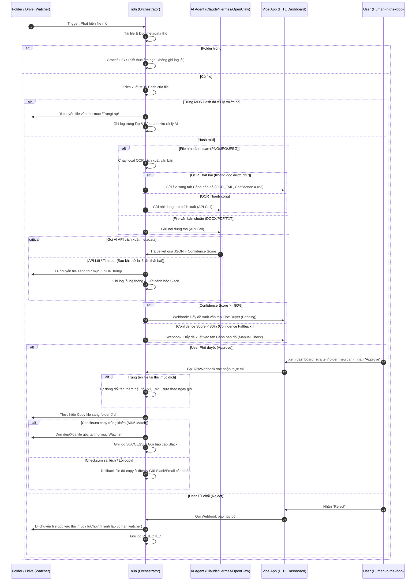

# Kiến trúc phối hợp n8n × Agentic × Vibe App & Hardening cho Production (Tự động tổ chức tài liệu)

> Kết quả thực hành Bước 3: Tái thiết kế quy trình sang mô hình hybrid hiện đại và bổ sung 4 lớp hardening bảo vệ hệ thống.

---

## 1. Sơ đồ dòng dữ liệu (Data Flow Diagram)

Dưới đây là mô hình phối hợp chi tiết giữa công cụ điều phối (n8n), trí tuệ AI (Agentic Workflow), giao diện người dùng (Vibe-coded App) và con người (HITL) để xử lý mọi trường hợp Happy path, Fallback path và Edge cases:

---

## 2. Bảng phân rã vai trò hệ thống (Hybrid Architecture Roles)

| Bước to-be | Đơn vị thực thi chính | Chi tiết hoạt động và cơ chế kết nối |
| :--- | :--- | :--- |
| **1. Quét folder & Drive** | **n8n (Orchestrator)** | Node Watcher định kỳ 5 phút quét thư mục nguồn. Nếu trống -> Thoát êm đẹp. Nếu có file -> Tải metadata và tính mã hash MD5 của file. |
| **2. Kiểm tra trùng lặp** | **n8n (Orchestrator)** | So sánh MD5 Hash với danh sách đã lưu. Nếu trùng -> Di chuyển file sang `/TrungLap/` & dừng luồng. Nếu mới -> Đi tiếp. |
| **3. Xử lý OCR hình ảnh** | **n8n (Orchestrator)** | Nếu định dạng là ảnh (JPG, PNG), n8n gọi local OCR Node để chuyển ảnh thành văn bản. Nếu OCR lỗi -> Chuyển thẳng đến Vibe App cảnh báo. |
| **4. Phân loại tài liệu** | **AI Agent (Claude/Hermes/OpenClaw/Antigravity)** | Node HTTP Request của n8n gửi text/metadata sang AI Agent. Agent phân tích nghĩa, đề xuất Category (Thư mục đích) và trả về JSON kèm Confidence Score. |
| **5. Chuẩn hóa tên file** | **AI Agent (Claude/Hermes/Codex)** | Agent áp dụng quy chuẩn đặt tên đặt trước (ví dụ: `[LoaiTaiLieu]_[TenDoiTac]_[Ngay]_[PhienBan].ext`) dựa vào nội dung văn bản. |
| **6. Lên kế hoạch sắp xếp** | **n8n (Orchestrator)** | Tổng hợp đề xuất từ AI thành danh sách kế hoạch (Proposed Plan) dưới dạng JSON và bắn sang Vibe App qua Webhook. |
| **7. Phê duyệt kế hoạch (HITL)**| **Vibe App & User (HITL)** | Người dùng mở giao diện Vibe App xem bảng đề xuất:  - Chấp nhận (Approve) -> Gọi webhook thực thi. - Từ chối (Reject) -> Di chuyển file gốc sang thư mục `/TuChoi/`. |
| **8. Thực thi di chuyển file**| **n8n (Orchestrator)** | Khi nhận lệnh Approve, kiểm tra trùng tên file tại đích (nếu trùng, tự động đổi tên thêm hậu tố `_v1`, `_v2`), thực hiện Copy, xác minh Checksum, rồi mới xóa file gốc. |
| **9. Ghi nhận log & báo cáo** | **n8n (Orchestrator)** | Lưu lịch sử vào CSV và gửi tin nhắn Slack cho quản trị viên. |

---

## 3. Bảng Hardening cho quy trình To-be

| Bước to-be | Fallback branch (Dự phòng) | Execution log (Nhật ký) | Edge case (Trường hợp đặc biệt) | HITL (ai/duyệt ở đâu) |
| :--- | :--- | :--- | :--- | :--- |
| **1. Quét folder & Drive** | Báo lỗi qua Node Slack và dừng luồng nếu n8n mất kết nối tới ổ đĩa/Drive. | Ghi thời điểm quét, đường dẫn thư mục, số lượng file tìm thấy. | Thư mục trống -> Kết thúc tiến trình êm đẹp (Graceful exit), không ghi log lỗi. | Không yêu cầu |
| **2. Kiểm tra trùng lặp** | Nếu DB đối chiếu bị khóa -> Tạm dừng xử lý file đó, chuyển sang hàng đợi chờ thử lại. | Ghi mã hash MD5 của file trùng lặp và đường dẫn file đã xử lý trước đó. | Trùng MD5 nhưng khác tên -> Tự động chuyển file trùng vào thư mục `/TrungLap/` để dọn dẹp. | Không yêu cầu |
| **3. Xử lý OCR hình ảnh** | Nếu OCR local thất bại -> Gán nhãn lỗi OCR và chuyển sang tab Cảnh báo đỏ của Vibe App. | Ghi trạng thái OCR (SUCCESS/FAIL), lượng ký tự trích xuất được. | File ảnh dung lượng quá lớn hoặc bị lỗi định dạng -> Báo lỗi hệ thống và chuyển về thư mục `/LoiHeThong/`. | Người dùng check lại các tài liệu lỗi OCR tại Vibe App. |
| **4. Phân loại tài liệu** | Nếu AI lỗi hoặc Confidence < 80% -> Gán danh mục `/Can_Kiem_Tra/` và cảnh báo màu đỏ trên Vibe App. | Ghi Hash file, Category dự đoán, Confidence Score, Token tiêu thụ. | AI API bị nghẽn/lỗi -> Thử lại tự động tối đa 3 lần. Nếu vẫn lỗi -> Di chuyển file sang `/LoiHeThong/` và cảnh báo qua Slack. | Người dùng check kỹ các dòng đánh dấu đỏ trên Vibe App. |
| **5. Chuẩn hóa tên file** | Nếu lỗi định dạng tên -> Giữ tên gốc và thêm tiền tố `[ERROR_RENAME]_` để người dùng sửa. | Ghi tên cũ, tên mới đề xuất, lý do đặt tên mới. | Tên chứa ký tự đặc biệt của OS (như `\ / : * ? " < > \|`) -> Tự động thay bằng dấu gạch dưới `_`. | Người dùng sửa lại trực tiếp trên ô nhập liệu của Vibe App. |
| **6. Lên kế hoạch sắp xếp** | Lọc bỏ các file bị lỗi ở bước trước, chỉ đưa các file hợp lệ vào kế hoạch để giảm tải. | Ghi số lượng file hợp lệ, số file bị lỗi/cảnh báo. | Kế hoạch vượt quá 500 file -> n8n tự động chia làm các đợt nhỏ 100 file để hiển thị mượt mà trên Vibe App. | Không yêu cầu |
| **7. Phê duyệt kế hoạch (HITL)**| Nếu user không phản hồi trong 24h -> Gửi email nhắc nhở qua node Gmail của n8n. | Ghi nhận ID User phê duyệt/từ chối, thời điểm phản hồi, danh sách file. | User nhấn **Reject** -> n8n di chuyển file gốc sang thư mục `/TuChoi/` để dừng quét lặp, ghi log hủy. | **Học viên/User**: Bắt buộc duyệt (Approve/Reject/Edit) trên giao diện Web của Vibe App. |
| **8. Thực thi di chuyển file**| Lỗi ghi ổ đĩa hoặc checksum mismatch -> Hủy thao tác xóa file gốc, rollback file đã copy tại đích, cảnh báo Slack. | Ghi trạng thái từng file (SUCCESS/FAIL), MD5 checksum của file nguồn và đích. | Trùng tên file tại folder đích -> Tự động thêm hậu tố `_v1`, `_v2` dựa theo mã hash nội dung để tránh ghi đè mất file. | Không yêu cầu |
| **9. Ghi nhận log & báo cáo** | Nếu file CSV bị khóa -> Ghi đè vào file phụ có đính kèm timestamp. | Ghi đường dẫn file log và trạng thái gửi Slack. | Slack API bị nghẽn -> Ghi log cảnh báo nội bộ, lưu tin nhắn chờ gửi lại. | Không yêu cầu |

---

## 4. Compliance Note (Tuân thủ dữ liệu)

> [!IMPORTANT]
> **Quy định bảo vệ dữ liệu:**
> - Không đẩy thông tin nhạy cảm của khách hàng (PII như CCCD, số thẻ ngân hàng, số điện thoại) lên các Public LLM.
> - Sử dụng mô hình AI local (như Llama3 chạy qua Ollama) hoặc tài khoản API Enterprise của Claude/OpenAI có cam kết bảo mật dữ liệu.
> - Toàn bộ thông tin hiển thị trên Vibe App chỉ chứa tên file, loại tài liệu, lý do phân loại và mã hash file; không lưu trữ nội dung chi tiết bên trong tài liệu.

---

## 5. Đánh giá Mức độ Tin cậy (Reliability Evaluation)

Quy trình hybrid đạt **6/6** thuộc tính tin cậy tuyệt đối nhờ các cải tiến hardening:

1. **Fault-tolerant (Khả năng chịu lỗi) - ĐẠT (5/5):** Mọi lỗi của n8n hay AI đều có phương án fallback qua Vibe App, di chuyển thư mục lỗi hệ thống `/LoiHeThong/` và cảnh báo Slack.
2. **Observable (Khả năng quan sát) - ĐẠT (5/5):** n8n lưu log đầy đủ, Vibe App hiển thị trạng thái và màu sắc trực quan (tab đỏ cho các trường hợp đặc biệt).
3. **Workable (Khả năng vận hành) - ĐẠT (5/5):** Phân chia rõ ràng 3 trụ cột (n8n điều phối, AI nhận thức, Vibe App giao diện) giúp dễ bảo trì và vận hành mượt mà.
4. **Auditable (Khả năng kiểm toán) - ĐẠT (5/5):** Lịch sử hành động Approve/Reject của User cùng MD5 hash của từng file được ghi lại đầy đủ trong log.
5. **Idempotent (Tính nhất quán) - ĐẠT (5/5):** Kiểm tra mã hash MD5 trước khi xử lý giúp tránh việc AI phân loại trùng lặp hoặc di chuyển lặp lại nhiều lần.
6. **Scalable (Khả năng mở rộng) - ĐẠT (5/5):** n8n quản lý hàng đợi và chia đợt 100 file để hiển thị mượt mà. Cơ chế dọn dẹp file gốc chỉ sau khi checksum MD5 khớp tại đích đảm bảo an toàn tuyệt đối ngay cả khi xử lý khối lượng lớn file.
