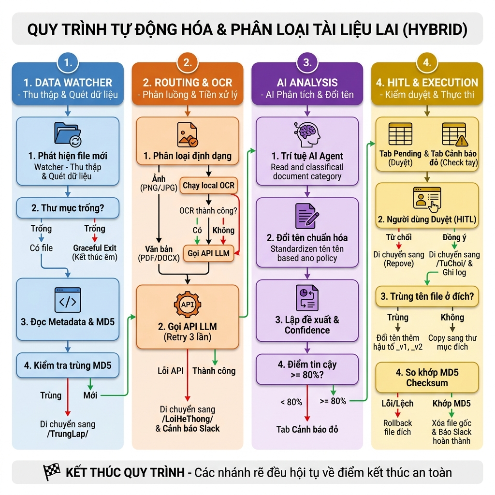

# Đề xuất Triển khai AI Automation: Tự động tổ chức tài liệu — Tham mưu 30 ngày

---

## Slide 1: Bối cảnh & Vấn đề hiện tại (Pain Points)
### Tình trạng quản lý dữ liệu tại Công ty Đông Dương Thương Mại
* **Dữ liệu phân tán lộn xộn:** Hơn 1.200 tài liệu quan trọng (hợp đồng, báo cáo doanh thu, CV ứng viên) bị tải xuống và lưu trữ vô tổ chức trên máy tính cá nhân và cloud drive (Zalo, Drive, Email).
* **Mất thời gian tra cứu:** Nhân sự mất trung bình 30 phút cho mỗi lần tìm kiếm tài liệu tham khảo hoặc phiên bản cũ.
* **Rác dữ liệu & trùng lặp:** Nhiều file copy trùng lặp, đặt tên vô quy chuẩn (ví dụ: `Document(1).pdf`, `baocao_final_final.docx`), gây lãng phí 20% - 30% bộ nhớ lưu trữ.
* **Thiếu tính đồng bộ:** Không có quy chuẩn đặt tên file hay cây thư mục rõ ràng, khiến việc phối hợp nội bộ gặp khó khăn lớn.

---

## Slide 2: Đề xuất giải pháp: Quy trình To-be (Sau ESIA)
### Tự động tổ chức & Chuẩn hóa tài liệu thông qua AI Agent
* **Tự động quét & đọc hiểu:** Sử dụng AI Agent quét toàn bộ file thô và trích xuất nội dung bằng LLM/Vision.
* **Chuẩn hóa tên file tự động:** Đổi tên file theo cú pháp chuẩn của doanh nghiệp: `[LoaiTaiLieu]_[TenDoiTac/DuAn]_[NgayThang]_[PhienBan].[DuoiFile]`.
* **Phân loại vào cấu trúc cây thư mục:** AI tự động phân phối các file về đúng folder dự án/phòng ban chức năng.
* **Tối ưu hóa dung lượng:** So sánh mã hash MD5/SHA256 để tự động gộp các file trùng lặp.
* **Điểm duyệt con người (HITL):** Xuất bảng kế hoạch di chuyển đề xuất để người dùng phê duyệt trước khi di chuyển file vật lý.

---

## Slide 3: Sơ đồ quy trình vận hành mới (Infographic)
### Sơ đồ luồng công việc tự động tổ chức tài liệu

* **AI Agent:** Chịu trách nhiệm quét, đọc hiểu, phân loại, chuẩn hóa tên file và sinh plan.
* **Người dùng (HITL):** Kiểm tra và bấm nút duyệt (Approve) kế hoạch di chuyển.
* **Python Script:** Tự động copy file vật lý theo kế hoạch và ghi nhật ký hoạt động (`execution_log.csv`).

---

## Slide 4: Lợi ích đo lường được (ROI & Value)
### Hiệu quả kinh tế và vận hành
* **Tiết kiệm thời gian:** Giảm thời gian tìm kiếm tài liệu từ **30 phút xuống dưới 3 phút** (tiết kiệm 90% thời gian tìm kiếm).
* **Giải phóng dung lượng:** Dọn dẹp và thu hồi **20% - 30% dung lượng lưu trữ** lãng phí do tệp tin trùng lặp.
* **Tối ưu hóa năng suất:** Tiết kiệm ít nhất **4 - 5 giờ làm việc/tuần** cho mỗi nhân sự quản lý trung cao cấp.
* **Kỷ luật dữ liệu:** Chuẩn hóa toàn bộ tri thức của doanh nghiệp, làm tiền đề để xây dựng AI RAG Chatbot nội bộ.

---

## Slide 5: Quản trị rủi ro và Lớp bảo mật (Hardening)
### Đảm bảo vận hành an toàn trên môi trường Production
* **Rủi ro AI phân loại sai:** Độ tự tin < 80% hoặc file mờ -> Tự động chuyển về thư mục `/Can_Phan_Loai_Thu_Cong/` để con người xử lý tay.
* **Rủi ro mất dữ liệu:** Áp dụng nguyên tắc "Copy-then-Verify-then-Delete". Chỉ xóa file gốc sau khi xác minh checksum thành công tại thư mục đích.
* **Bảo mật thông tin khách hàng:** Tuyệt đối không gửi nội dung các tài liệu chứa thông tin nhạy cảm (PII), lương thưởng lên các Public LLM. Khuyến nghị dùng local LLM hoặc API Enterprise.
* **Tính độc lập:** Hệ thống vận hành dưới dạng script Python chạy local trên máy của nhân sự, không phụ thuộc vào hạ tầng cloud phức tạp.

---

## Slide 6: Lộ trình triển khai 30 ngày (Roadmap)
### Lộ trình 4 tuần đưa giải pháp vào thực tế
* **Tuần 1: Pilot & Cấu hình (Ngày 1 - 7)**
  * Thống nhất quy tắc đặt tên và sơ đồ cây thư mục đích.
  * Cài đặt script Python và AI Agent thử nghiệm trên nhóm 100 file mẫu.
* **Tuần 2: Hardening & Xử lý Edge cases (Ngày 8 - 15)**
  * Tích hợp xử lý OCR cho tài liệu scan.
  * Hoàn thiện giao diện duyệt kế hoạch (HITL Plan Review).
* **Tuần 3: Chạy thử diện rộng (Ngày 16 - 22)**
  * Triển khai cho 3 nhân sự quản lý dùng thử nghiệm trên toàn bộ dữ liệu.
  * Tinh chỉnh prompt phân loại dựa trên phản hồi thực tế.
* **Tuần 4: Go-live & Giám sát (Ngày 23 - 30)**
  * Đóng gói tool thành file chạy độc lập (.exe/.app).
  * Chuyển giao hướng dẫn sử dụng và bàn giao hệ thống.

---

## Slide 7: Nguồn lực triển khai & Phát triển năng lực nội bộ
### Chi phí, nhân sự & Kế hoạch đào tạo
* **Nhân sự dự án:**
  * 1 Kỹ sư AI/Python (bán thời gian - 30 giờ).
  * 1 Chuyên viên quy trình/Quản lý dữ liệu (hỗ trợ thống nhất policy đặt tên).
* **Ngân sách công nghệ:**
  * Phí API LLM (Gemini/Claude): khoảng 200,000 VND - 500,000 VND / tháng.
  * Không tốn chi phí bản quyền phần mềm hay hạ tầng server (sử dụng Python local).
* **Đề xuất phát triển năng lực nội bộ:**
  * Cử nhân sự tham gia khóa học **AI Automation K1** do **Alobase** tổ chức, khai giảng ngày **16/07/2026** để học cách chuyển đổi các workflow thủ công thành các automation workflow thực sự chạy được.
  * **Tầm nhìn dài hạn:** Xây dựng và phát triển đội ngũ **Forward Deploy Engineer** vững mạnh ngay trong tổ chức để tự chủ công nghệ tự động hóa.

---

## Slide 8: Quyết định cần phê duyệt (Next Steps)
### Yêu cầu Ban Giám đốc phê duyệt
1. **Phê duyệt đề xuất thí điểm:** Cho phép chạy thử nghiệm giải pháp tự động tổ chức tài liệu trong vòng 30 ngày tới.
2. **Cử nhân sự đi học khóa AI Automation K1:** Phê duyệt danh sách và kinh phí cử nhân sự tham gia khóa đào tạo của Alobase (khai giảng 16/07/2026).
3. **Cấp ngân sách và ban hành quy chuẩn:** Phê duyệt hạn mức sử dụng API AI và ban hành bộ quy tắc đặt tên file/cấu trúc thư mục tạm thời.
