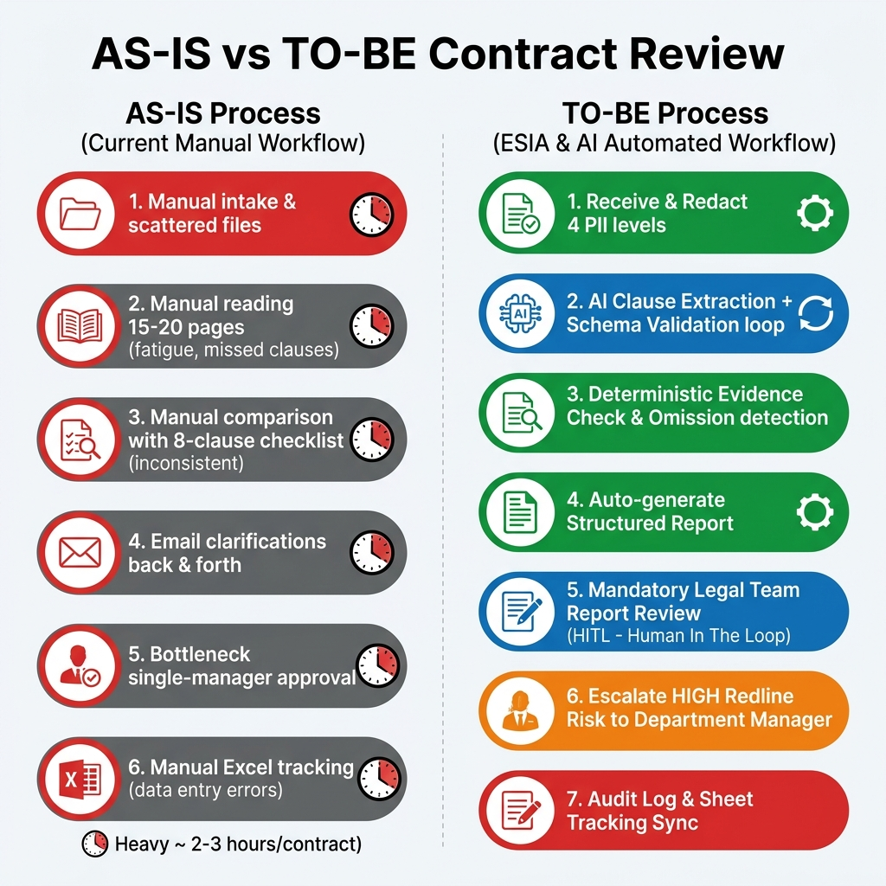

# W2 — As-is → ESIA to-be (Contract Review)

> BT2. Mô tả hiện trạng trung thực, áp ESIA, đề xuất quy trình mới + phân nhánh automation.
> Input: use-case #1 từ `01-usecase-matrix.md`. Bám chặt `../lab.md` (4 TH).

## Quy trình: Rà soát hợp đồng dịch vụ
**Người mô tả:** Lộc (GV) · **Ngày:** 2026-08-03 · **Nguồn:** lab.md B4

---

## Bước 1 — Bảng AS-IS (5 cột, ≥5 bước)

| # | Bước | Người thực hiện | Input | Output | Điểm nghẽn / Lỗi lặp |
|---|------|-----------------|-------|--------|----------------------|
| 1 | Nhận hợp đồng `.docx` từ đối tác/bộ phận | Trợ lý pháp chế | email/file share | file `.docx` raw (có PII) | File nằm rải rác, không version |
| 2 | Đọc trọn 15–20 trang, đánh dấu điều khoản | Chuyên viên pháp chế | `.docx` raw | ghi chú tay / comment Word | Mất 2–3h/đồng; mệt → bỏ sót omission |
| 3 | So sánh với checklist 8 điều khoản bắt buộc | Chuyên viên pháp chế | ghi chú + checklist | bản thiếu sót | Checklist không nhất quán giữa người; dễ sót "chấm dứt đơn phương" |
| 4 | Trao đổi câu hỏi/làm rõ với đối tác | Chuyên viên pháp chế | bản thiếu sót | email làm rõ | Chậm, phụ thuộc lịch đối tác |
| 5 | Trình trưởng phòng duyệt | Trưởng phòng Pháp chế | file + ghi chú | chữ ký / yêu cầu sửa | Throttle 1 người duyệt → cổ chai |
| 6 | Lưu file + ghi theo dõi deadline/giá trị | Trợ lý pháp chế | file đã duyệt | Sheet theo dõi | Nhập tay giá trị → sai số |

**Ghi chú as-is:**
- Thời gian tổng: ~2–3 giờ/hợp đồng · ~20–50 hợp đồng/tháng.
- Tần suất: hàng ngày/có hợp đồng mới.
- Công cụ đang dùng: Word, Excel, email.

---

## Bước 2 — Bảng TO-BE (ESIA + AI/Người + nhánh automation + HITL)

| Bước (to-be) | Hành động | Chi tiết tối ưu & điểm HITL | Ai làm | Nhánh automation |
|---------------|-----------|------------------------------|--------|------------------|
| 1. Nhận + Redact 4 cấp PII | **A** | Code node Python redact tên/MST/giá trị/điều khoản nhạy cảm trước khi qua AI; cấp 4 (mật) = cổng DỪNG → AI local. **HITL:** không, nhưng gate mật cần người xác nhận dừng | n8n (Code node) | n8n |
| 2. Extract clause + Schema validate | **A** | AI node Gemini extract `clauses.json` → Code node Python `jsonschema.validate`. FAIL → loop AI (max 2). PASS → đi tiếp. Đảm bảo đủ 8 điều khoản + `evidence.verbatim_quote`. **HITL:** không (schema = máy quyết định PASS/FAIL) | AI + Code | n8n (AI node + Code node) |
| 3. Evidence check + omission | **A** | Code node Python: `if verbatim_quote not in contract_text → hallucination_flag`. Check 8 điều khoản bắt buộc → omission. **HITL:** không (xác minh tất định bằng Python) | Code | n8n (Code node) |
| 4. Tổng hợp + xuất report | **A** | Code node gộp → `report.xlsx`: sheet Tóm tắt (số hallucination/omission/redline) + Chi tiết (clause, evidence, flag, severity, gợi ý sửa) + section HITL. | Code | n8n |
| 5. **Pháp chế duyệt report (HITL)** | **S** | Pháp chế đọc report (không đọc trọn hợp đồng) → điền "Người duyệt + ngày + quyết định (duyệt / yêu cầu sửa / từ chối)". **HITL BẮT BUỘC** (BR-W2: quyết định pháp lý + tiền bạc) | Người | không (HITL) |
| 6. Case HIGH escalate trưởng phòng | **I** | Phát hiện redline HIGH (BMTT/phạt/chấm dứt) → tự động route thêm trưởng phòng duyệt kép. **HITL** trưởng phòng | Người | n8n (route IF) |
| 7. Lưu + ghi theo dõi | **A** | n8n Write deadline/giá trị (đã redact) vào Sheet + `run-log.jsonl` audit. | n8n | n8n |

### Ký hiệu: E — Eliminate · S — Simplify · I — Integrate · A — Automate

---

## HITL note (rõ bước nào & tại sao)

> **Quy tắc vàng (BR-W2):** Quyết định "duyệt hợp đồng" LUÔN thuộc con người. Workflow chỉ **đề xuất + flag**.

- **Bước 5 — duyệt report:** HITL bắt buộc. Lý do: quyết định pháp lý + tiền bạc + ảnh hưởng nghĩa vụ đối tác. KHÔNG auto-approve.
- **Bước 6 — case HIGH:** HITL kép (chuyên viên + trưởng phòng). Lý do: BMTT/phạt/chấm dứt = hậu quả nặng, cần duyệt cấp cao hơn.
- **Bước 1 gate cấp 4 (mật):** nếu phát hiện hợp đồng mật → STOP, không qua AI công. Chuyển AI local/on-prem. Người xác nhận dừng.
- **Bước 2/3 (schema + evidence):** KHÔNG HITL — đây là máy tất định (Python), KHÔNG phải "AI tự thấy ổn". Đây chính là harness cốt lõi (determinism).
- **Confidence AI < 0.7** ở bước 2 → `need_review=true` → tự động đẩy bước 5 cho Pháp chế chú ý (HITL).

> SLI/SLO W2: as-is ≥5 bước ✅ · to-be mỗi bước có E/S/I/A + AI/Người + nhánh ✅ · ≥1 HITL ✅ · bước tiền bạc/pháp lý HITL ✅.
