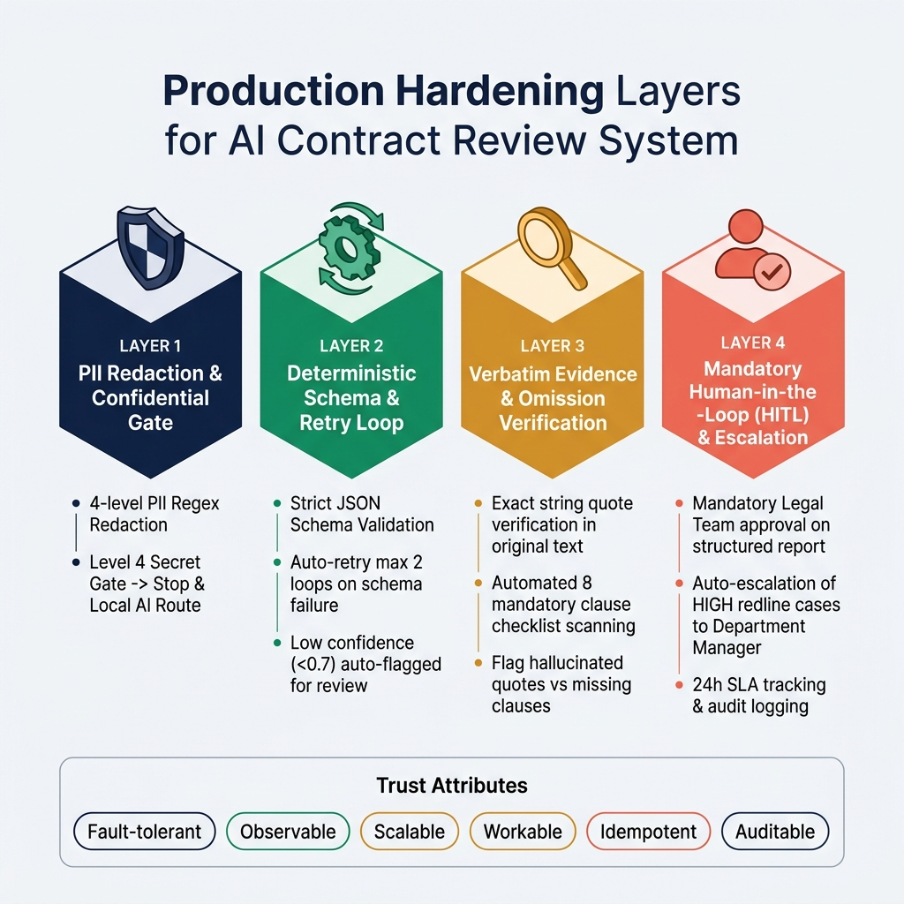

# W3 — Production Hardening (4 lớp + 6 thuộc tính tin cậy)

> BT3. Bổ sung 4 lớp hardening vào to-be để chạy production được.
> Input: bảng to-be từ `02-as-is-tobe.md`. Bám `../lab.md` TH1–TH4 (redaction/schema/evidence/HITL).

## Bảng hardening (4 lớp)

| Bước to-be | Fallback branch | Execution log | Edge case | HITL (ai/khi nào) |
|------------|-----------------|---------------|-----------|---------------------|
| 1. Redact 4 cấp | Cấp 4 phát hiện mật → STOP, route AI local; regex sót PII → cảnh báo + flag `need_review` | `run-log.jsonl`: input hash, số PII redact/cấp, OK/WARN/FAIL | Hợp đồng scan ảnh (cần OCR trước); file rỗng; encoding lỗi (BOM/UTF-16) | Người xác nhận dừng khi phát hiện cấp 4 |
| 2. AI extract + Schema validate | Schema FAIL → loop AI (max 2) → vẫn FAIL → `need_review=true`, đánh flag malformed | AI model, token dùng, retry count, schema PASS/FAIL, `contract_id` | AI timeout / rate-limit; AI trả JSON cắt giữa dòng; hợp đồng > token limit → chia clause-set | Confidence < 0.7 → đẩy HITL bước 5 |
| 3. Evidence + omission check | Verbatim không match do dấu câu/newline → normalize whitespace rồi check lại; vẫn fail → flag `need_review` (không vội kết luận hallucination) | Mỗi clause: match True/False, omission list, checklist TC đã rà | Clause evidence là bảng/hình (không extract text được); 8 điều khoản nhưng gộp 1 clause | — |
| 4. Tổng hợp + report | Write Sheet fail → lưu local `.xlsx` + cảnh báo Slack/email | Số hallucination/omission/redline HIGH-MED-LOW, thời gian chạy end-to-end | Hợp đồng 0 clause extract; report rỗng | — |
| 5. Pháp chế duyệt (HITL) | Pháp chế vắng → SLA 24h → escalate trưởng phòng; quyết định treo quá 48h → follow-up | Người duyệt, ngày, quyết định (duyệt/sửa/từ chối), lý do | Pháp chế từ chối nhưng không điền lý do → yêu cầu bắt buộc | Pháp chế — mọi hợp đồng |
| 6. Case HIGH escalate | Trưởng phòng vắng → deputy; không ai duyệt 48h → KÉT giữ, không ký | Route reason, người duyệt kép, timestamp | 2 redline HIGH xung đột hướng xử | Trưởng phòng — khi có redline HIGH |
| 7. Lưu + Sheet theo dõi | Sheet API fail → retry 3 × (backoff) → lưu local JSON, sync sau | deadline/giá trị redact ghi, run-id | Giá trị đã redact không parse được số | — |

## Compliance note
> Hợp đồng = dữ liệu cá nhân (PII đối tác) + có thể liên quan nghĩa vụ tài chính.
> Bước 1 (redaction) là điều kiện tiên quyết đưa dữ liệu qua AI công — bảo vệ ở nguồn.
> Bước 5 (duyệt) liên quan quyết định pháp lý + tiền bạc → **bắt buộc HITL** theo quy định nội bộ.
> Cấp 4 (mật) → không qua AI công, chỉ AI local — tuân thủ quy định bảo mật.

## Mức độ tin cậy — tự đánh giá thẳng thắn (6/6 thuộc tính)

| Thuộc tính | Đánh giá | Lý do |
|------------|----------|-------|
| **Fault-tolerant** | một phần | Có fallback loop schema (max 2), gate mật, retry Sheet. Nhưng AI timeout kéo dài chưa có hàng đợi async |
| **Observable** | đạt | `run-log.jsonl` mỗi bước (hash + trạng thái OK/WARN/FAIL + output); report có audit trail |
| **Scalable** | một phần | n8n Cloud scale batch; nhưng token limit AI bắt phải chia clause-set với hợp đồng rất dài |
| **Workable** | đạt | Pháp chế duyệt report (không đọc全文); HITL rõ ai/khi nào; SLA 24h |
| **Idempotent** | đạt | Cùng `source_contract_id` + redact regex tất định → cùng output; rerun không tạo report kép |
| **Auditable** | đạt | `run-log.jsonl` + report có "Người duyệt + ngày + quyết định"; evidence verbatim truy nguồn được |

**Tổng:** 4 đạt · 2 một phần · 0 thiếu. Hai điểm "một phần" (fault-tolerant async + scalable token) = backlog production sau pilot 10 hợp đồng.

> SLI/SLO W3: đủ 4 lớp ✅ · 6 thuộc tính tự đánh giá ✅ · bước PII/tiền bạc HITL ✅ · không overclaim ✅.
