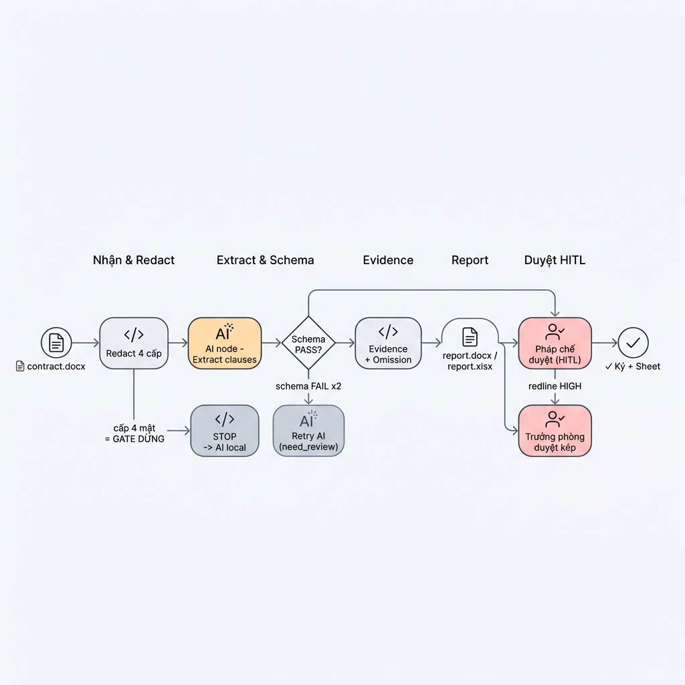

# W5 — Prompt render ảnh workflow (infographic)

> BT5. Dán vào Codex / Nano Banana / Gemini (image gen). Nếu lỗi font tiếng Việt, thêm dòng diacritic.
> Local-first: có thể dùng **screenshot mermaid.live từ `04-mermaid.mmd`** làm ảnh workflow (đã render đẹp).

## Prompt image-gen

```text
A professional, modern horizontal business process infographic diagram on a clean, light gray background (#F8FAFC). Crisp technical line-art with subtle pastel color fills and distinct isometric 3D icons. All Vietnamese diacritics must render correctly (ấ ầ ờ ư ơ ạ ụ ơ ế).

LAYOUT & STRUCTURE:
- Visualize the provided Mermaid flowchart horizontally, strictly left to right.
- Segment into stages separated by thin elegant vertical dividers: Nhận & Redact → Extract & Schema → Evidence → Report → Duyệt HITL.
- Connectors are thin dark gray arrows with smooth right-angle bends.

NODE STYLES:
- Each node = stylized rounded capsule (pastel) with Vietnamese label.
- AI steps (orange #FFE0B2) with robot/AI icon — label "AI node: extract clauses".
- Human-in-the-loop steps (soft red #FFCDD2) with person-review icon — labels "Pháp chế duyệt (HITL)" và "Trưởng phòng duyệt kép".
- Fallback steps (gray #ECEFF1) — labels "Retry AI" và "STOP → AI local".
- Decision diamonds: "schema PASS?" và branching.
- Start: document icon (📄 contract.docx). End: check/flag (✓ Ký + Sheet).

BRANCHING:
- "schema FAIL ×2" branches up to retry; PASS continues right.
- "cấp 4 mật" branches to STOP gate.
- "redline HIGH" branches to trưởng phòng.

TYPOGRAPHY:
- Modern sans-serif (Inter / Segoe UI), high contrast, crisp 8k.
- No overlapping, perfect alignment, plenty of white space.

OUTPUT: high-resolution sharp PNG.
```

## Mermaid source (render cùng)

Xem `04-mermaid.mmd` (dán toàn bộ mã `.mmd` vào cuối prompt nếu tool yêu cầu).

## Link ảnh
-  — Ảnh infographic workflow thẩm định hợp đồng đã được tạo.

## Label tiếng Việt chính xác
✅ Kiểm tra: "Redact 4 cấp", "extract clauses", "schema PASS?", "evidence + omission", "Pháp chế duyệt (HITL)", "Trưởng phòng duyệt kép", "Retry AI", "STOP → AI local".

> SLI/SLO W5: prompt có style spec + Mermaid source ✅ · label tiếng Việt chính xác ✅.
