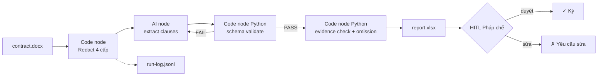

# B4 Foundation — Contract Review: n8n + Harness Engineering (nền 4 TH)

> NỀN buổi 4. Tool chính = **n8n** (Code node Python validate). Track A/B móc vào đây.
> Tư duy mới: **Harness Engineering (schema+evidence) + Determinism (Python) + Redaction 4 cấp**.

## 0. Use-case (doanh nghiệp thật)
Công ty 200-500 NV, ~20-50 hợp đồng/tháng. Pháp chế 1-2 người không rà hết. Workflow: hợp đồng `.docx` → n8n flow (redact → extract schema-validated → evidence-check → report) → Pháp chế duyệt (HITL).
Kết quả đo: <10'/hợp đồng (vs 2-3h tay); bắt clause bịa (hallucination) + omission; Pháp chế chỉ duyệt report.

## 1. ESIA

### Steps (4 TH = 4 tư duy, n8n)
1. **TH1 — Redaction 4 cấp** (trước khi qua AI): Code node Python redact PII/theo 4 cấp → AI chỉ thấy bản che. Output: `contract-redacted.md`.
2. **TH2 — Extract + Schema validation** (harness/determinism): AI extract clauses.json → **Code node Python validate JSON schema** (jsonschema) → FAIL = loop lại AI. Output: schema-valid `clauses.json`.
3. **TH3 — Evidence check** (harness): **Code node Python** check mỗi clause's `evidence` (verbatim) tồn tại trong contract text → flag `hallucination`. + rà omission (checklist 8 điều khoản). Output: `evidence-checked.json` + omission list.
4. **TH4 — Harness gộp + report + HITL**: gộp 3 TH thành 1 n8n workflow end-to-end → `report.xlsx` (clause, evidence, hallucination_flag, omission, severity) + section "Người duyệt + ngày + quyết định".

### Exceptions (n8n IF/Code node)
- Schema fail → Code node raise → loop AI (max 2) → vẫn fail → flag `need_review`.
- Evidence không thấy trong contract → `hallucination_flag=true`.
- Confidence AI < 0.7 → `need_review=true`.
- Phát hiện clause nhạy cảm (BMTT/phạt/chấm dứt) → escalate Pháp chế trưởng.

### Inputs
- Hợp đồng `.docx`/`.pdf` (PII đối tác → redact cấp 1 trước).
- `templates/checklist-rui-ro.json` (12 TC).
- `templates/clause.schema.json` (schema cho clauses.json — TH2).

### Outputs (data contract, chain N→N+1, `source_contract_id`)
`contract-redacted.md → clauses.json (schema-valid) → evidence-checked.json → report.xlsx` + `run-log.jsonl`.

### Accountability (RACI)
| Vai trò | Trách nhiệm |
|---------|-------------|
| n8n workflow + Code node Python | redact, extract, validate schema, check evidence — **tất định** |
| AI (Gemini node) | extract (đề xuất), KHÔNG quyết định duyệt |
| Pháp chế (HITL) | đọc report, duyệt/sửa/từ chối |
| Trưởng phòng | case HIGH (BMTT/phạt/chấm dứt) duyệt kép |

## 2. Harness Engineering (tư duy mới — chi tiết)

### 2a. Schema (determinism — "đủ chân")
- Mọi output extract phải pass JSON schema (Code node Python `jsonschema`).
- `clauses.schema.json`: required `contract_id`, `clauses[]` (mỗi clause: `id`, `tieu_de`, `noi_dung`, `evidence`, `confidence_score`, `need_review`), `evidence[]`, `confidence_score`, `need_review`.
- AI trả thiếu field/malformed → Code node FAIL → retry. **Kết quả: cấu trúc tất định.**

### 2b. Evidence verbatim (harness — "có thật")
- Mỗi clause phải có `evidence.verbatim_quote` (nguyên văn trong hợp đồng) + `location` (clause ID).
- Code node Python: `if verbatim_quote not in contract_text: hallucination_flag = true`.
- **Kết quả: bắt được clause AI bịa** (chống hallucination — kẻ thố chết người ở pháp lý).

### 2c. Determinism (Python, không tin mood AI)
- Validate schema + check evidence = **Python Code node**, không phải prompt "hãy kiểm tra".
- Code cho PASS/FAIL rõ → n8n route theo IF. Không "AI tự thấy ổn".

## 3. Redaction 4 cấp (tham khảo CCHC `bao-mat-ktnn.md`)

> Nguyên tắc: **bảo vệ ở nguồn**. Che trước khi qua AI, VẪN dùng được AI.

| Cấp | Che cái gì | Thay bằng | Ví dụ hợp đồng |
|-----|-----------|-----------|----------------|
| **1 — Định danh cá nhân (PII)** | tên người, CMND/CCCD, SĐT, email cá nhân | `Bên A`, `nguyenvanA`, `0xxx`, `@demo.vn` | người đại diện 2 bên |
| **2 — Tài chính** | giá trị hợp đồng, số tài khoản, MST, đơn giá | `[giá trị redact]`, làm tròn | giá trị HĐ, MST đối tác |
| **3 — Nhạy cảm nghiệp vụ** | đối tác chiến lược, danh mục BMTT, điều khoản độc quyền, threshold | `Bên B`, `[BMTT redact]`, giữ cấu trúc che threshold | clause BMTT, độc quyền |
| **4 — Mật / cấm** | bí mật nhà nước, hồ sơ mật, số liệu ĐVKT thật | **KHÔNG qua AI công — cổng DỪNG**, chỉ AI local/on-prem | (hợp đồng mật chính phủ) |

> Code node Python TH1: nhận contract → regex redact cấp 1-3 → output bản che. Cấp 4 = gate (nếu phát hiện → STOP, yêu cầu AI local).

## 4. Diagram (n8n)

## 5. Handover
`report.xlsx`: sheet "Tóm tắt" (số clause bịa/omission/redline HIGH-MED-LOW) + "Chi tiết" (clause, evidence, hallucination_flag, severity, gợi ý sửa) + section HITL. Run-log `.jsonl` audit. KHÔNG auto gửi/ký.

## Mapping 6 guarantee + tư duy mới
- G3 = package này. G4a Track A = HV build 4 TH trong n8n (redact→schema→evidence→gộp). G4b Track B = HV thay use-case hợp đồng cơ quan + chỉnh schema/redaction. G6 = consistency-check.
- **Tư duy mới B4:** TH2=schema, TH3=evidence, TH4=determinism(Python gộp), TH1=redaction 4 cấp — đúng 3 trụ harness+determinism+redact user yêu cầu.
