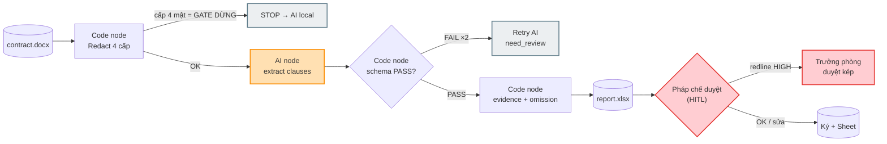

# Workflow Design Doc — Contract Review (Buổi 4)

> Design Doc 7 phần — ráp từ W2–W6. Nguồn sự thật: `../lab.md` (lab handout B4 Contract Review).
> Tác giả: Lộc (GV) · Ngày: 2026-08-03 · Phòng ban: Pháp chế · Use-case (từ W1): #1 Rà clause bịa + omission.
> Tư duy mới B4: **Harness Engineering (schema + evidence) + Determinism (Python) + Redaction 4 cấp**.

---

## 1. Hiện trạng (as-is)
*(Từ W2)*

| # | Bước | Người thực hiện | Input | Output | Điểm nghẽn / Lỗi lặp |
|---|------|-----------------|-------|--------|----------------------|
| 1 | Nhận `.docx` từ đối tác | Trợ lý pháp chế | email/share | file raw (có PII) | File rải rác, không version |
| 2 | Đọc trọn 15–20 trang | Chuyên viên pháp chế | `.docx` raw | ghi chú tay | 2–3h/đồng; mệt → sót omission |
| 3 | So checklist 8 điều khoản bắt buộc | Chuyên viên pháp chế | ghi chú + checklist | bản thiếu sót | Không nhất quán giữa người; dễ sót "chấm dứt đơn phương" |
| 4 | Làm rõ với đối tác | Chuyên viên pháp chế | bản thiếu sót | email | Chậm, phụ thuộc lịch đối tác |
| 5 | Trình trưởng phòng duyệt | Trưởng phòng Pháp chế | file + ghi chú | chữ ký / yêu cầu sửa | 1 người duyệt → cổ chai |
| 6 | Lưu + Sheet theo dõi | Trợ lý pháp chế | file đã duyệt | Sheet | Nhập tay giá trị → sai số |

**Tổng:** ~2–3 giờ/hợp đồng · ~20–50 hợp đồng/tháng.

---

## 2. Phân tích ESIA & to-be
*(Từ W2)*

| Bước (to-be) | E/S/I/A | Chi tiết & HITL | Ai làm | Nhánh automation |
|---------------|---------|-----------------|--------|------------------|
| Redact 4 cấp PII | **A** | Code node Python; cấp 4 mật = cổng DỪNG → AI local | n8n | n8n |
| Extract + Schema validate | **A** | AI Gemini → `clauses.json` → Python `jsonschema`. FAIL→loop max 2 | AI+Code | n8n |
| Evidence + omission check | **A** | Python `verbatim_quote not in text → hallucination_flag`; check 8 điều khoản | Code | n8n |
| Tổng hợp + report | **A** | `report.xlsx`: Tóm tắt + Chi tiết + section HITL | Code | n8n |
| Pháp chế duyệt (HITL) | **S** | Đọc report → duyệt/sửa/từ chối. **HITL BẮT BUỘC** | Người | không |
| Case HIGH escalate | **I** | Redline HIGH (BMTT/phạt/chấm dứt) → duyệt kép trưởng phòng | Người | n8n (IF) |
| Lưu + Sheet | **A** | Write deadline/giá trị redact + `run-log.jsonl` | n8n | n8n |

**Ký hiệu:** E — Eliminate · S — Simplify · I — Integrate · A — Automate

**HITL note (BR-W2):** Quyết định "duyệt hợp đồng" LUÔN thuộc human. Workflow chỉ đề xuất + flag. Bước tiền bạc/pháp lý (5, 6) HITL bắt buộc; bước schema/evidence (2, 3) KHÔNG HITL vì máy tất định.

---

## 3. Hardening cho production
*(Từ W3)*

| Bước to-be | Fallback | Execution log | Edge case | HITL |
|------------|----------|---------------|-----------|------|
| Redact 4 cấp | Cấp 4 → STOP AI local; regex sót → flag | hash, số PII/cấp, OK/WARN/FAIL | scan/OCR, file rỗng, encoding lỗi | Người xác nhận dừng cấp 4 |
| Extract+Schema | FAIL→loop max 2→`need_review` | model, token, retry, PASS/FAIL | timeout, JSON cắt, token limit | confidence<0.7 → HITL |
| Evidence+omission | normalize whitespace rồi check lại; fail→`need_review` | match/clause, omission, TC đã rà | evidence là bảng/hình | — |
| Tổng hợp+report | Write fail → local `.xlsx` + Slack | số flag, severity, runtime | 0 clause extract | — |
| Pháp chế duyệt | Vắng→SLA 24h→escalate | người duyệt, ngày, quyết định, lý do | từ chối không lý do → bắt buộc | Pháp chế — mọi HĐ |
| Case HIGH | Trưởng phòng vắng→deputy; 48h→KÉT | route reason, duyệt kép, ts | 2 redline xung đột | Trưởng phòng |
| Lưu+Sheet | retry 3× backoff→local JSON | deadline/giá trị redact, run-id | giá trị không parse số | — |

**Compliance note:** PII đối tác + nghĩa vụ tài chính → bước 1 (redact) là điều kiện tiên quyết; bước 5 (duyệt) bắt buộc HITL; cấp 4 (mật) chỉ AI local.

**Mức độ tin cậy (6/6):** fault-tolerant một phần · observable đạt · scalable một phần · workable đạt · idempotent đạt · auditable đạt. **Tổng 4 đạt / 2 một phần / 0 thiếu.**

---

## 4. Sơ đồ quy trình mới (Mermaid)
*(Từ W4 — file `04-mermaid.mmd`)*

---

## 5. Ảnh render workflow
*(Từ W5 — `05-image-prompt.md`)*

 — *prompt render ảnh + Mermaid source. Fallback: screenshot mermaid.live.*

---

## 6. So sánh Trước & Sau (Before / After)

| | Trước (as-is) | Sau (to-be) |
|---|---|---|
| Thời gian | 2–3 giờ/hợp đồng | <10'/hợp đồng (KPI lab) |
| Lỗi | Sótt omission/clause bịa do mệt | Evidence check Python bắt hallucination + omission |
| Chi phí | Pháp chế读全文, capacity nghẽn | Pháp chế chỉ duyệt report → giải phóng capacity |
| Audit | Ghi chú tay, khó truy nguồn | `run-log.jsonl` + section HITL |

> Số `<10'` = KPI lab; số giờ tiết kiệm/tháng thực tế → `[cần đo]` sau pilot 10 hợp đồng.

---

## 7. Danh sách bước cần tự động hóa
*(Tổng hợp W2–W3)*

| Bước A | Công cụ | Điểm duyệt người (HITL) | Phương án dự phòng |
|--------|---------|--------------------------|--------------------|
| Redact 4 cấp | n8n Code node Python | Cấp 4 mật → người xác nhận dừng | Regex sót → flag + cảnh báo |
| Extract clause | n8n AI node (Gemini) | confidence<0.7 → Pháp chế | Schema FAIL → loop max 2 → `need_review` |
| Schema validate | n8n Code node (`jsonschema`) | — (máy tất định) | malformed → retry AI |
| Evidence + omission | n8n Code node Python | — (máy tất định) | match fail do dấu câu → normalize rồi check lại |
| Tổng hợp + report | n8n Code node | Pháp chế duyệt report | Write fail → local `.xlsx` + Slack |
| Lưu + Sheet | n8n Write | — | retry 3× backoff → local JSON sync sau |

---

## Nguồn & kế thừa
- Use-case cốt lõi: `esia-usecase.md` (hợp đồng dịch vụ, planted 1 omission + 3 redline).
- 4 TH chain (TH1→TH2→TH3→TH4): `../lab.md`.
- Downstream: Track A = HV build 4 TH trong n8n · Track B = HV customize hợp đồng cơ quan · Scoring: `vibe-score-workflow-design`.
