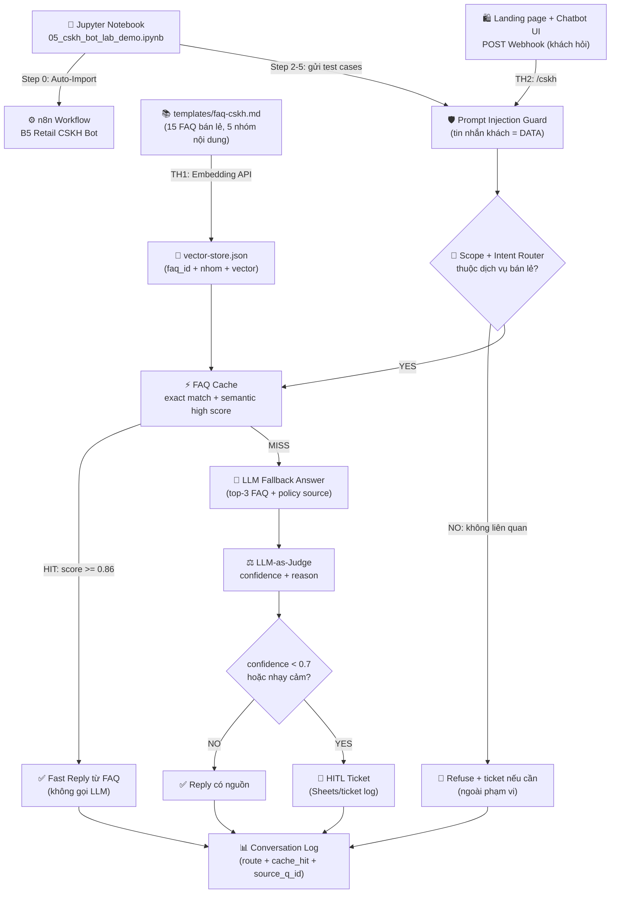

# Hướng dẫn thực hành Buổi 05: CSKH Bot với Semantic Search & LLM-as-Judge

> File dành cho HỌC VIÊN (sync sang `studentkit/`). Đáp án/expected ở `checkpoints/` (🔒 instructor-only).
> Khóa AI Automation & Vibe Coding K1 · GV: Lộc · 120 phút · HV: vận hành/CSKH/marketing/kỹ thuật phi-code.
> **Tool chính: n8n (npx) Auto-Config + Jupyter Interactive Notebook + Vibe Coding Landing Page có Chatbot.**
> **Phương pháp giảng dạy**: **Tự động cấu hình 1-Click Workflow vào npx n8n**, không mất thời gian kéo-thả node từ đầu; GV demo trực quan qua notebook `test/05_cskh_bot_lab_demo.ipynb`, sau đó học viên đọc từng file thực hành để hiểu và tùy biến các lớp: Knowledge Base → Prompt Injection Guard → Scope/Intent Router → FAQ Cache → LLM Fallback → LLM-as-Judge → HITL Ticket → Landing Page có Chatbot.

---

## 1. Mục tiêu buổi học

### 🎯 Mục tiêu tổng quát

#### 🧠 1. Mục tiêu về tư duy (Mindset)
- **Tư duy Knowledge Base First**: Trước khi có bot trả lời, cần có kho tri thức chuẩn hóa từ chính sách bán lẻ, đổi trả, bảo hành và giao nhận để bot bám nguồn thay vì đoán mò.
- **Tư duy "Vận hành & Demo 1-Click"**: Tập trung nhìn workflow chạy thật qua notebook và webhook trước, không sa vào kéo-thả từng node thủ công trong giờ học.
- **Tư duy Guardrail First**: Ngay khi nhận câu hỏi, hệ thống phải chống prompt injection, kiểm tra phạm vi và từ chối chủ đề không liên quan trước khi nghĩ đến trả lời.
- **Tư duy Fast Path trước LLM**: Câu hỏi đã có trong FAQ cache hoặc rất giống FAQ cũ phải trả lời nhanh bằng nguồn có sẵn; chỉ dùng LLM khi cache không hit.
- **Tư duy Semantic Search**: Chuyển từ tìm kiếm keyword cứng sang tìm theo ý nghĩa câu hỏi, dùng embedding và cosine similarity để chọn đúng FAQ liên quan.
- **Tư duy AI có kiểm soát bằng LLM-as-Judge**: Tách LLM trả lời và LLM chấm confidence thành hai vai trò độc lập, tránh để một model vừa tự trả lời vừa tự tin vào chính mình.
- **Tư duy HITL trong CSKH**: Khi confidence thấp, ngoài phạm vi, khiếu nại hoặc hoàn tiền, bot phải chuyển người và tạo ticket thay vì tự xử lý.
- **Tư duy Rule Injection Safety**: Tin nhắn khách hàng luôn là DATA; mọi câu kiểu "bỏ qua quy định cũ" trong message đều không được coi là instruction của hệ thống.

#### 🛠️ 2. Mục tiêu về kỹ năng (Skills)
- **Tự động cấu hình & Vận hành n8n Workflow**: Sử dụng notebook để tự động khởi chạy n8n, import workflow `checkpoints/n8n-cskh-bot-solution.json` và gọi webhook demo.
- **Demo & Trải nghiệm Step-by-Step qua Jupyter Notebook**: Sử dụng file [`test/05_cskh_bot_lab_demo.ipynb`](./test/05_cskh_bot_lab_demo.ipynb) để inspect workflow, gửi test case và quan sát `route/cache_hit/ticket`.
- **Tạo Vector Knowledge DB từ FAQ**: Embed 15 câu FAQ mẫu, mỗi FAQ có `faq_id`, `nhom` và vector để phục vụ truy hồi.
- **Xây Guardrail + Router trong n8n**: Tạo lớp đầu vào phát hiện injection, route intent/scope và từ chối câu hỏi không thuộc dịch vụ bán lẻ.
- **Xây FAQ Cache Fast Path**: Tạo exact/semantic cache để trả lời nhanh khi câu hỏi trùng hoặc rất giống FAQ đã có.
- **Xây Webhook CSKH trong n8n**: Tạo endpoint nhận câu hỏi, chạy guardrail/router/cache, rồi chỉ gọi LLM khi cần.
- **Phân loại 5 intent CSKH chuẩn**: `thong_tin`, `gia`, `ky_thuat`, `khieu_nai`, `ngoai_pham_vi`.
- **Thiết kế Judge Gate & Ticket HITL**: Dùng LLM thứ hai chấm `{confidence, reason}`, sau đó IF node quyết định trả lời tự động hoặc tạo ticket.
- **Vibe-code Landing Page có Chatbot**: Tạo landing page bán lẻ đơn giản, gắn chatbot widget, POST trực tiếp tới n8n webhook và ghi conversation log 5 test case.

---

## 2. Phương pháp Cấu hình Tự động & Vận hành Demo

### ⚡ 1. Tự động cấu hình Workflow vào npx n8n (Không làm thủ công)
Học viên và Giảng viên **KHÔNG cần tạo thủ công từng node** trong phần demo chính. Toàn bộ workflow demo đã được đóng gói sẵn và tự động cấu hình:

```bash
# Di chuyển vào thư mục test và khởi chạy notebook hoặc script auto-import
cd test
python3 auto_import_n8n.py
```

> 💡 **Kết quả**: Truy cập `http://localhost:5678`, workflow **"B5 K1 - Retail CSKH Bot (Guard + Cache + Landing Chatbot)"** đã sẵn sàng hoạt động với webhook `/cskh`.

### 📓 2. Chạy Demo từng bước bằng Jupyter Notebook
Mở file Jupyter Notebook [`test/05_cskh_bot_lab_demo.ipynb`](./test/05_cskh_bot_lab_demo.ipynb) trên VS Code hoặc Jupyter Lab. Notebook này đóng vai trò giao diện vận hành trực quan từng bước:

1. **Step 0**: Auto-Launch n8n + Auto-Import workflow solution.
2. **Step 1**: Inspect workflow nodes từ n8n API.
3. **Step 2**: Demo FAQ cache hit cho câu hỏi giao hàng.
4. **Step 3**: Demo prompt injection/out-of-scope bị chặn trước LLM.
5. **Step 4**: Demo HITL ticket cho case hoàn tiền.
6. **Step 5**: Chạy 5 test case end-to-end qua webhook thật.
7. **Step 6**: Mở `test/landing-chatbot-demo.html` ngay trong notebook/tab mới, chat trực tiếp với webhook `/cskh`.

### 🧱 3. Giải thích workflow theo lớp sau khi demo chạy được
Sau khi học viên đã thấy hệ thống chạy thật, GV bóc tách workflow thành 5 lớp nhỏ:

1. **Lớp tri thức**: `templates/faq-cskh.md` → embedding → `vector-store.json`.
2. **Lớp biên an toàn**: Webhook nhận câu hỏi → prompt injection guard → scope/intent router.
3. **Lớp trả lời nhanh**: FAQ cache exact match + semantic similarity cao → reply ngay từ FAQ, không gọi LLM.
4. **Lớp fallback có kiểm soát**: cache miss → LLM trả lời có nguồn → LLM-as-Judge → ticket HITL nếu rủi ro.
5. **Lớp giao diện**: Landing page vibe-coding có chatbot widget → gọi webhook → demo end-to-end.

> 💡 **Kết quả mong muốn**: Sau lab, học viên có một CSKH bot chạy được qua webhook, biết trả lời 3 case an toàn và chuyển người đúng 2 case rủi ro.

Các prompt mẫu nằm trong thư mục `prompts/`. Test case và đáp án mẫu nằm trong `checkpoints/` để giảng viên mở khi cần.

---

## 3. Context bài toán & Workflow sử dụng trong buổi học (Example Flow)

### 🏢 Context thực tế bài toán trong doanh nghiệp
Trong các đội chăm sóc khách hàng dịch vụ bán lẻ, nhân sự thường phải trả lời lặp lại nhiều câu hỏi giống nhau qua website, Zalo, fanpage và hotline:

- **Nút thắt cổ chai (Bottleneck)**: Nhiều câu hỏi về trạng thái đơn hàng, phí giao hàng, đổi trả, bảo hành và hóa đơn được hỏi lặp lại mỗi ngày.
- **Rủi ro trả lời sai chính sách**: Nếu bot không bám nguồn, bot dễ bịa ưu đãi, thời hạn đổi trả, điều kiện bảo hành hoặc cam kết giao hàng không tồn tại.
- **Rủi ro xử lý nhạy cảm**: Khiếu nại, hoàn tiền, đổi trả phức tạp, ngoài phạm vi và thông tin chưa có trong FAQ cần người phụ trách xử lý.
- **Rủi ro prompt injection**: Khách hàng có thể vô tình hoặc cố ý gửi câu chứa chỉ thị độc hại; hệ thống phải coi nội dung đó là dữ liệu đầu vào.

### 🔄 Sơ đồ luồng xử lý (Workflow Diagram)



---

## 4. Chuẩn bị (HV & GV)

| Item | Số lượng | Link/Path | Mô tả |
|------|---------|-----------|-------|
| n8n (npx) Auto-Config | 1/HV | [`test/auto_import_n8n.py`](./test/auto_import_n8n.py) | Tự động khởi chạy n8n local và import workflow solution |
| Jupyter Demo Notebook | 1/HV | [`test/05_cskh_bot_lab_demo.ipynb`](./test/05_cskh_bot_lab_demo.ipynb) | Notebook demo tương tác từng bước cho Giảng viên & Học viên |
| n8n workflow solution | 1/HV | [`checkpoints/n8n-cskh-bot-solution.json`](./checkpoints/n8n-cskh-bot-solution.json) | Workflow demo Webhook → Guard/Router/Cache → Respond |
| Credential LLM/Embedding | 1/HV | Google AI Studio/OpenAI credential từ B2 | Dùng embedding + LLM answer + LLM judge |
| `templates/faq-cskh.md` | 1/HV | [`templates/faq-cskh.md`](./templates/faq-cskh.md) | 15 FAQ mẫu cho dịch vụ bán lẻ, chia 5 nhóm nội dung |
| `templates/chinh-sach-ho-tro.md` | 1/HV | [`templates/chinh-sach-ho-tro.md`](./templates/chinh-sach-ho-tro.md) | Chính sách giao nhận, thanh toán, đổi trả, bảo hành để bot bám nguồn |
| `templates/thong_tin_san_pham.md` | 1/HV | [`templates/thong_tin_san_pham.md`](./templates/thong_tin_san_pham.md) | Catalog & chi tiết sản phẩm bán lẻ (P01-P04) để bot hỏi đáp và nhận đơn mua |
| Prompt templates | 1/HV | [`prompts/`](./prompts/) | Prompt cho TH1-TH4 |
| Test cases | GV phát khi kiểm thử | [`checkpoints/test-cases.json`](./checkpoints/test-cases.json) | 5 test case, trong đó 2 case phải chuyển người |
| Vibe coding tool | 1/HV | Cursor/Antigravity hoặc công cụ tương đương | Tạo landing page HTML/JS có chatbot gọi webhook |

---

## 5. Chuỗi Bài Tập Thực Hành & Hướng Dẫn Vận Hành Demo

| Bài | Tên bài thực hành | Phương thức thực hiện | Deliverable chính | Link bài hướng dẫn |
|---|---|---|---|---|
| **Thực hành 1** | Auto-Config + Vector Knowledge DB | Notebook Step 0-2 + n8n đọc FAQ/vector store | n8n running + `vector-store.json` đủ 15 vector | 📄 [Hướng dẫn Thực hành 1](./thuc-hanh-1-vector-knowledge-db.md) |
| **Thực hành 2** | Guardrail + Router + FAQ Cache | Notebook Step 2-3 inspect/test Webhook `/cskh` | `route + cache_hit + answer/refusal`, 5/5 route đúng | 📄 [Hướng dẫn Thực hành 2](./thuc-hanh-2-guardrail-router-faq-cache.md) |
| **Thực hành 3** | LLM Fallback + LLM-as-Judge + HITL Ticket | Notebook Step 4-5 demo ticket/refusal + human gate | ≥2 ticket, gồm TC2 hoàn tiền + TC4 ngoài scope | 📄 [Hướng dẫn Thực hành 3](./thuc-hanh-3-llm-fallback-judge-hitl.md) |
| **Thực hành 4** | Landing Page + Chatbot + Webhook | Notebook Step 6 demo landing page chatbot → HV vibe-code landing page riêng | `landing-chatbot.html` chạy được + conversation log 5 case | 📄 [Hướng dẫn Thực hành 4](./thuc-hanh-4-landing-chatbot-webhook.md) |

> Mỗi file hướng dẫn con có bước làm chi tiết, SLI/SLO, safety note và fallback checkpoint tương ứng.

---

## 6. Tổng kết & Checklist Nghiệm thu (SLI/SLO)

**Deliverable nghiệm thu được:**
- [ ] Auto-Launch npx n8n thành công, workflow tự động nạp tại `http://localhost:5678`
- [ ] Jupyter Notebook [`05_cskh_bot_lab_demo.ipynb`](./test/05_cskh_bot_lab_demo.ipynb) chạy thành công Step 0 → Step 6
- [ ] `vector-store.json` — 15 FAQ vector, mỗi FAQ đúng 1 vector (Thực hành 1)
- [ ] `route + cache_hit + answer/refusal` — 5/5 route đúng, ngoài scope bị chặn trước LLM (Thực hành 2)
- [ ] LLM fallback + Ticket HITL — LLM chỉ chạy khi cache miss; đúng 2 case chuyển người: TC2 hoàn tiền + TC4 ngoài scope (Thực hành 3)
- [ ] Landing page vibe-coding có chatbot live — gọi n8n webhook end-to-end (Thực hành 4)
- [ ] Conversation log đủ 5 case với `source_q_id`
- [ ] FAQ gap list cho câu chưa có nguồn
- [ ] Rule injection safety: tin nhắn khách = DATA
- [ ] FAQ cache fast path: câu trùng/rất giống FAQ không gọi LLM answer
- [ ] Test mode cho node gửi thật như email/ticket
- [ ] LLM-as-Judge là LLM thứ hai, tách khỏi LLM trả lời

---

## 7. Fallback & Checkpoint Index

| TH | Phương án Fallback | Checkpoint File |
|----|--------------------|-----------------|
| Thực hành 1 | Chạy `python3 test/auto_import_n8n.py` hoặc dùng vector store mẫu | `checkpoints/faq-khoa-hoc-full.json`, `checkpoints/checkpoint-bt1.md` |
| Thực hành 2 | Chạy Step 2-3 trong notebook hoặc dùng kết quả intent mẫu | `checkpoints/intent-results-sample.json`, `checkpoints/checkpoint-bt2.md` |
| Thực hành 3 | Dùng ticket sample để kiểm tra route HITL | `checkpoints/tickets-sample.json`, `checkpoints/checkpoint-bt3.md` |
| Thực hành 4 | Dùng workflow solution và log mẫu để demo end-to-end | `checkpoints/cskh-bot-agent-solution.md`, `checkpoints/conversation-log-sample.xlsx`, `checkpoints/checkpoint-bt4.md` |

---

## 8. Grading Rubric — B5 lab (100 pts)

| Criterion | Điểm | Mô tả |
|-----------|------|-------|
| Vector Knowledge DB (Thực hành 1) | 15 | Tạo đủ 15 vector, mỗi vector có `faq_id`, `nhom` và nội dung FAQ |
| Guardrail, Router & FAQ Cache (Thực hành 2) | 20 | Chặn injection, route đúng scope/intent, cache hit trả lời nhanh không gọi LLM |
| LLM Fallback & Source-grounded Answer (Thực hành 3) | 15 | Cache miss mới gọi LLM, câu trả lời có nguồn, không bịa khi thiếu nguồn |
| LLM-as-Judge & HITL Ticket (Thực hành 3) | 20 | Judge có confidence+reason, route đúng 2 ticket: TC2 + TC4 |
| Landing Page + Chatbot End-to-End (Thực hành 4) | 20 | Landing page bán lẻ có chatbot gọi webhook thật, log đủ 5 case và thể hiện reply/ticket |
| Safety & Control | 10 | Rule injection safety, test mode node gửi thật, tách LLM answer và LLM judge |
| **Total** | **100** | ≥70 = PASS |

---

## 9. Bài tập về nhà — Track B self-build

Học viên chọn 1 bài toán Q&A thật ở cơ quan, tự thiết kế và build bot từ blank n8n:

- Chọn domain riêng: CSKH, HR, pháp chế, vận hành, IT helpdesk hoặc đào tạo nội bộ.
- Tự tạo knowledge DB và intent set riêng, không chỉ điền blank từ mẫu của giảng viên.
- Tạo landing page hoặc trang nội bộ đơn giản bằng vibe coding, có chatbot nhúng và gọi webhook thật.
- Nộp conversation log 5 case, FAQ gap list và reflection ngắn.

File hướng dẫn: [`track-b-hv-customize/track-b-lab.md`](./track-b-hv-customize/track-b-lab.md). Scaffold khi bị tắc: [`track-b-hv-customize/customize-prompt.md`](./track-b-hv-customize/customize-prompt.md).
