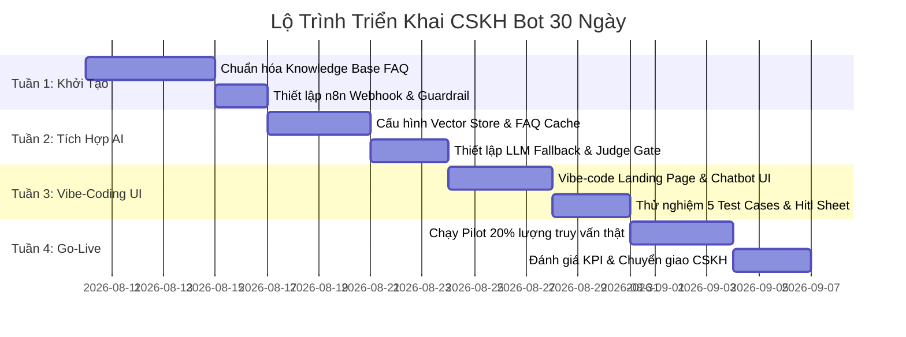

# Pha 6: Deck Tham Mưu Lãnh Đạo — Tự Động Hóa CSKH Bán Lẻ (CRAFT Format)

> **Mục tiêu:** Đóng gói đề xuất tự động hóa CSKH thành tài liệu tham mưu cho Ban Giám Đốc / Trưởng phòng Vận hành với lộ trình 30 ngày và đo lường ROI rõ ràng.

---

## 1. Executive Summary (Bối Cảnh & Mục Tiêu)

- **Bối cảnh hiện tại:** Đội CSKH bán lẻ 2 người đang tiếp nhận 50-100 truy vấn/tuần. 75% trong số đó là các câu hỏi lặp lại về chính sách giao hàng, thanh toán, đổi trả và bảo hành.
- **Vấn đề cốt lõi:** Nhân sự quá tải, thời gian phản hồi trung bình 15-30 phút/tin nhắn, nguy cơ trả lời không nhất quán chính sách hoặc bỏ sót ca khiếu nại.
- **Giải pháp đề xuất:** Triển khai **Hệ thống CSKH Bot đa tầng (Guardrail + FAQ Fast Path + LLM-as-Judge + HITL Ticket)** vận hành trên n8n webhook và Landing Page Chatbot.

---

## 2. Lợi Ích Đo Lường Được (Measurable ROI)

| Chỉ số (Metric) | Hiện trạng (As-is) | Mục tiêu 30 ngày (To-be) | Mức độ cải thiện |
|---|---|---|---|
| **Thời gian phản hồi câu hỏi lặp lại** | 15 - 30 phút | **< 2 giây** (qua FAQ Cache) | **Giảm 99%** |
| **Tỷ lệ tự động hóa an toàn** | 0% | **70% - 75%** tổng số câu hỏi | **Giải phóng 1.5 nhân sự** |
| **Rủi ro bịa thông tin (Hallucination)** | Có (khi nhân viên quên rule) | **0%** (100% bám kho tri thức FAQ) | **Tối ưu độ uy tín** |
| **Chi phí API phát sinh / 1,000 chat** | Không dùng AI | **< $1.50** (nhờ Fast Path Cache) | **Tiết kiệm 80% chi phí AI** |
| **Thời gian tiếp nhận Ticket nhạy cảm** | 2 - 4 giờ | **< 5 phút** (Auto Ticket Sheet) | **Tăng sự hài lòng (CSAT +25%)** |

---

## 3. Lộ Trình Triển Khai 30 Ngày (30-Day Roadmap)

### Chi tiết các cột mốc:
- **Tuần 1 (Tập trung Tri thức & An toàn):** Đóng gói 15-50 FAQ bán lẻ thành file `faq-cskh.md`. Dựng lớp Guardrail chặn Prompt Injection.
- **Tuần 2 (Tập trung Tốc độ & Kiểm soát):** Xây dựng Fast Path Vector Cache (Cosine score ≥0.86). Cấu hình LLM-as-Judge chấm confidence.
- **Tuần 3 (Tập trung Trải nghiệm UI & HITL):** Gắn Chatbot widget vào Landing Page bán lẻ. Tích hợp Google Sheets Ticket cho CSKH.
- **Tuần 4 (Go-Live & Mở Rộng):** Cho chạy thật 20% traffic, theo dõi log `confidence < 0.7` và fine-tune kho tri thức.

---

## 4. Quản Lý Rủi Ro & Đảm Bảo Tuân Thủ

- **Rủi ro Prompt Injection:** Đã kiểm chứng qua Guard Node — mọi tin nhắn từ khách hàng đều được xử lý dưới dạng DATA thuần túy.
- **Rủi ro Hoàn tiền / Khiếu nại:** Cấu hình Scope Router tự động đẩy 100% ca `khieu_nai` và `hoan_tien` sang luồng HITL Ticket. Nhân sự CSKH trực tiếp ra quyết định.
- **Rủi ro Hệ thống gián đoạn:** Nếu OpenAI/Google API sự cố, n8n tự động chuyển sang tin nhắn chờ cố định và báo về Telegram/Email CSKH.

---

## 5. Khuyến Nghị Hành Động Dành Cho Lãnh Đạo

1. **Phê duyệt đề xuất:** Duyệt kế hoạch triển khai CSKH Bot đa tầng theo lộ trình 30 ngày.
2. **Cấp ngân sách thử nghiệm:** Ngân sách API thử nghiệm dự kiến: $10 - $20 / tháng.
3. **Phân công đầu mối:** Chỉ định 01 Trưởng nhóm CSKH phối hợp chuẩn hóa kho tri thức và tiếp nhận Ticket HITL.
