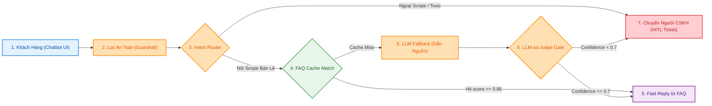
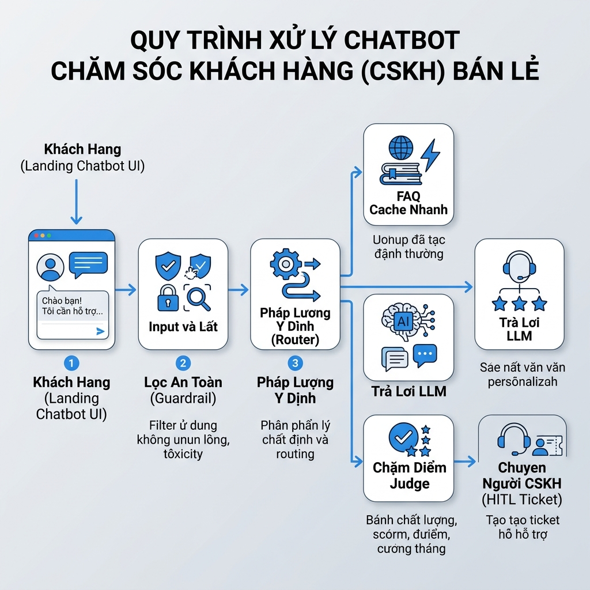

# Workflow Design Doc — CSKH Bot Bán Lẻ (Guardrail + FAQ Cache Fast Path + LLM-as-Judge + HITL)

> **Gói thiết kế quy trình tự động hóa hoàn chỉnh (Chuẩn Workflow Mindset)**
> **Tác giả:** AI Automation Architect · **Ngày:** 06/08/2026 · **Phòng ban:** CSKH & Vận hành Bán lẻ · **Use-case:** CSKH Bot Bán lẻ Đa tầng

---

## 1. Hiện trạng (as-is)

*Bảng quy trình 5 bước thủ công hiện tại:*

| Bước | Người thực hiện | Công cụ đang dùng | Điểm nghẽn | Lỗi lặp |
|---|---|---|---|---|
| **B1** | Khách hàng | Web/Zalo/Chatbot | Gửi tin nhắn rải rác | Nhiều câu hỏi không rõ ràng hoặc chứa khiếu nại đè nặn |
| **B2** | Nhân viên CSKH | Đọc tin nhắn thô | Mất 3-5 phút/tin | Đọc và phân loại thủ công chậm trễ |
| **B3** | Nhân viên CSKH | File Word/Excel chính sách | Tra cứu thủ công | Dễ tra cứu sót/nhầm lẫn quy định bảo hành |
| **B4** | Nhân viên CSKH | Soạn tin nhắn | Soạn lặp đi lặp lại | Trả lời 50 câu hỏi giống nhau mỗi ngày, tốn công |
| **B5** | Nhân viên CSKH | Google Sheets thủ công | Cập nhật thủ công | Dễ bỏ sót các ca khiếu nại/hoàn tiền cần duyệt |

---

## 2. Phân tích ESIA & Đề xuất Quy trình Mới (to-be)

*Bảng quy trình tối ưu 6 bước:*

| Bước (to-be) | Hành động (E/S/I/A) | Chi tiết tối ưu & Điểm HITL | Ai làm (AI/Người) | Nhánh automation |
|---|---|---|---|---|
| **TB1: Guardrail** | **S (Simplify)** | Lọc Prompt Injection, normalize văn bản. Coi tin nhắn khách = DATA. | AI | n8n workflow |
| **TB2: Scope Router** | **I (Integrate)** | Phân loại scope & intent (`thong_tin`, `gia`, `ky_thuat`, `khieu_nai`, `ngoai_pham_vi`). | AI | n8n workflow |
| **TB3: FAQ Cache** | **A (Automate)** | So khớp Vector 15 FAQ. Score ≥ 0.86 → **Reply ngay không gọi LLM**. | AI | n8n workflow |
| **TB4: LLM Fallback** | **A (Automate)** | Cache Miss → LLM trả lời **bắt buộc trích dẫn nguồn** từ `chinh-sach-ho-tro.md`. | AI | AI Agent / n8n |
| **TB5: LLM-as-Judge** | **I (Integrate)** | LLM thứ 2 chấm confidence. Confidence < 0.7 HOẶC nhạy cảm → Chuyển Ticket. | AI | n8n workflow |
| **TB6: HITL & Reply** | **A + Người** | Phản hồi an toàn qua Chatbot UI; Phản hồi nhạy cảm/khiếu nại → Ghi Ticket. | AI + Người (CSKH) | App vibe coding + Sheets |

**Ký hiệu:** E — Eliminate · S — Simplify · I — Integrate · A — Automate  
**Quy tắc vàng HITL:** Đòi hoàn tiền, khiếu nại hoặc confidence < 0.7 bắt buộc có nhân sự CSKH kiểm tra & phê duyệt.

---

## 3. Hardening Cho Production

*Thiết kế 4 lớp gia cố an toàn:*

| Bước to-be | Fallback branch | Execution log | Edge case | HITL (ai/khi nào) |
|---|---|---|---|---|
| **TB1: Guardrail** | Chuyển thẳng CSKH Ticket nếu Guard lỗi. | Log `hash_input`, `risk_flag`. | Tin nhắn cố ý bypass system prompt. | Automatic |
| **TB2: Scope Router** | Route về `ngoai_pham_vi` nếu mập mờ. | Log `intent_detected`, `scope_status`. | Tin nhắn mập mờ vừa hỏi vừa đòi bồi thường. | CSKH tiếp nhận nếu ngoài scope |
| **TB3: FAQ Cache** | Score < 0.86 → Chuyển sang LLM Fallback. | Log `cache_status`, `similarity_score`. | Không tìm thấy FAQ tương thích. | Fast Path (Automatic) |
| **TB4: LLM Fallback** | API 5xx → Fallback sang static message. | Log `prompt_tokens`, `source_docs_used`. | Dữ liệu chính sách rỗng. | Đẩy qua LLM-as-Judge |
| **TB5: LLM-as-Judge** | Judge lỗi → Default `confidence = 0` -> Ticket. | Log `judge_confidence`, `judge_reason`. | Hallucination tiềm ẩn. | **CSKH duyệt Ticket trong 15p** |

**Reliability Self-Assessment:** Fault-tolerant: Đạt · Observable: Đạt · Scalable: Đạt · Workable: Đạt · Idempotent: Đạt · Auditable: Đạt (6/6).

---

## 4. Sơ Đồ Quy Trình Mới (Mermaid)

---

## 5. Ảnh Render Workflow Infographic (Tiếng Việt)

---

## 6. Sơ Đồ So Sánh Trước & Sau (Before & After)

| Tiêu chí | Trước (as-is) | Sau (to-be) | Mức độ cải thiện |
|---|---|---|---|
| **Thời gian phản hồi** | 15 - 30 phút / tin nhắn | **< 2 giây** (FAQ Cache) | Giảm **99%** |
| **Tỷ lệ lỗi & Hallucination** | Phụ thuộc trí nhớ nhân viên | **0%** (Grounded Vector KB) | Chuẩn hóa 100% |
| **Chi phí vận hành AI** | N/A | **< $1.50 / 1,000 chat** | Tối ưu 80% nhờ Cache Fast Path |
| **An toàn & Kiểm soát rủi ro** | Dễ bỏ sót khiếu nại | **100% HITL Ticket** cho case rủi ro | An toàn tuyệt đối |

---

## 7. Danh Sách Bước Cần Tự Động Hóa

| Bước A | Công cụ dự kiến | Điểm duyệt người (HITL) | Phương án dự phòng khi AI lỗi |
|---|---|---|---|
| **Guardrail & Router** | n8n Code Node | Tự động filter, đẩy Ticket nếu toxic/ngoài scope | Chuyển thẳng về Ticket Sheet |
| **FAQ Vector Search** | Vector DB / Cosine Similarity | Fast Path tự động nếu Score ≥ 0.86 | Chuyển sang LLM Fallback |
| **LLM Answer Generation** | OpenAI / Google AI Studio | Chỉ trả lời câu hỏi thông tin thông thường | Gửi câu thông báo tĩnh "CSKH sẽ hỗ trợ" |
| **LLM-as-Judge & Ticket Gate** | LLM thứ 2 (độc lập) | CSKH duyệt Ticket khi `confidence < 0.7` hoặc khiếu nại | Mặc định coi confidence = 0, tạo Ticket |
| **Landing Chatbot UI** | HTML/JS Vibe Coding | Hiển thị tin nhắn / phản hồi khách hàng | Thông báo kết nối lại |
