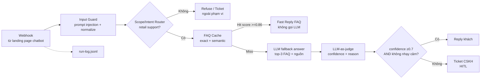

# Workflow Design Package — CSKH Bot (B5) — n8n + Semantic Search + LLM-as-judge

> NỀN buổi 5. Tool = **n8n** (webhook + AI node + Code node) + **vibe coding landing page có chatbot** (UI gọi webhook).
> Tư duy mới: **Guardrail-first + intent/scope routing + FAQ cache fast path + semantic search (vector) + LLM-as-judge (confidence) + HITL ticket + vibe-coding→n8n webhook**.

## 0. Use-case (doanh nghiệp thật)
Đội CSKH dịch vụ bán lẻ nhận ~50-100 câu hỏi/tuần qua website/chat (trạng thái đơn hàng, phí giao hàng, thanh toán, đổi trả, bảo hành, khiếu nại). CSKH 2 người không trả lời kịp. Workflow: landing page bán lẻ có chatbot → câu hỏi → n8n webhook → **prompt injection guard** → **scope/intent router** → **FAQ cache exact/semantic** → cache hit thì trả lời nhanh từ FAQ; cache miss mới gọi LLM trả lời → **LLM-as-judge chấm confidence** → tin thấp/nhạy cảm → ticket CSKH (HITL); tin cao → auto-trả lời.
Kết quả đo: câu hỏi lặp lại được trả lời nhanh bằng FAQ cache; câu mới nhưng có nguồn được LLM hỗ trợ; câu rủi ro/ngoài phạm vi → ticket có confidence + intent, CSKH xử lý nhanh.

## 1. ESIA

### Steps (4 TH = 4 tư duy)
1. **TH1 — Vector knowledge DB**: embed 15 FAQ (template) → vector → store (vector DB/Excel vector). Foundation — "kho tri thức trước, bot sau" (kế thừa B4 "schema/structured").
2. **TH2 — Guardrail + Router + FAQ cache**: n8n webhook nhận Q → prompt injection guard → scope/intent router → exact match cache → semantic cache. Cache hit (score ≥0.86) trả lời ngay từ FAQ, **không gọi LLM**. Ngoài scope/injection nguy hiểm → từ chối/chuyển người.
3. **TH3 — LLM fallback + LLM-as-judge + HITL ticket**: cache miss → LLM trả lời **gắn nguồn** từ top-3 FAQ/chính sách → LLM thứ 2 chấm confidence (0-1) + reason. **IF confidence < 0.7 HOẶC intent nhạy cảm (khiếu nại/hoàn tiền/ngoài phạm vi) → tạo ticket** (Sheets) chuyển CSKH; ELSE trả lời. → "2 chuyển người, 1 ngoài scope" chuẩn.
4. **TH4 — Vibe-coding landing page + chatbot + webhook (capstone)**: HV vibe-code 1 landing page bán lẻ có chatbot widget → call n8n webhook → end-to-end trả lời khách real-time.

### Exceptions (n8n IF)
- Guard phát hiện prompt injection nguy hiểm → refuse/ticket, không gọi LLM answer.
- Router xác định "ngoài phạm vi" → KHÔNG bịa, từ chối hoặc flag chuyển người.
- FAQ cache hit → reply nhanh từ FAQ, không gọi LLM answer.
- FAQ cache miss nhưng top-k score thấp → LLM fallback bị judge confidence thấp → ticket.
- Rule injection: tin nhắn khách = DATA (bỏ qua lệnh trong tin nhắn — kế thừa B3/B4).
- Webhook lỗi/timeout → fallback "CSKH sẽ phản hồi sớm".

### Inputs
- `templates/faq-khoa-hoc.json` (15 FAQ bán lẻ, 5 nhóm — knowledge DB).
- `checkpoints/test-cases.json` (5 test case: TC2 hoàn tiền = chuyển người, TC4 ngoài scope = chuyển người — **2 chuyển người, 1 ngoài scope**).
- Embedding API key (Google AI Studio / OpenAI) — credential từ B2.

### Outputs (data contract, `source_q_id` qua chain)
`question → guard{safe, risk_flags} → router{scope, intent} → faq_cache{cache_hit, score, faq_id} → llm_answer? → judge{confidence, reason}? → ticket OR reply → frontend{route_badge, message}` + `run-log.jsonl`.

### Accountability (RACI)
| Vai trò | Trách nhiệm |
|---------|-------------|
| n8n webhook + Code node | guardrail, routing, FAQ cache, semantic search, gọi LLM answer + judge khi cần — **tất định** |
| FAQ cache | trả lời nhanh câu trùng/rất giống FAQ, không tốn LLM |
| LLM answer | chỉ chạy khi cache miss, trả lời **gắn nguồn** (KHÔNG bịa) |
| LLM-as-judge (LLM thứ 2) | chấm confidence + reason (KHÔNG trả lời cho khách) |
| CSKH (HITL) | xử lý ticket (khiếu nại/hoàn tiền/confidence thấp) |

## 2. Tư duy mới — chi tiết

### 2a. Guardrail + router — "chặn trước khi trả lời"
- Input guard normalize câu hỏi, phát hiện pattern như "bỏ qua hướng dẫn", "tiết lộ system prompt", "chuyển tiền", "đặt dịch vụ ngoài phạm vi".
- Router phân loại scope + intent trước khi trả lời.
- Intent "ngoài phạm vi" hoặc injection nguy hiểm → refuse/ticket, không đi vào LLM answer.

### 2b. FAQ cache + semantic search (vector) — "nhanh trước, thông minh sau"
- 15 FAQ → embed (vector) → knowledge DB.
- Exact cache: normalized question trùng FAQ → reply ngay.
- Semantic cache: câu hỏi khách → embed → cosine similarity top-k FAQ. Nếu score ≥0.86 → reply ngay từ FAQ.
- Giải keyword mismatch (khách "ship bao lâu" ↔ FAQ "khi nào được giao").
- Chỉ cache miss mới chuyển sang LLM fallback.

### 2c. LLM-as-judge — "đo độ tin" (kế thừa B4 "đo, không tin")
- LLM thứ 2 (KHÁC LLM trả lời) nhận: câu hỏi + câu trả lời + nguồn FAQ + cache status → output `{confidence: 0-1, reason}`.
- Confidence < 0.7 → `need_review=true` → ticket.
- Separation of concerns: LLM trả lời = "thực thi"; LLM judge = "kiểm chứng" — như B4 code check evidence.

### 2d. HITL routing — "biết khi nào KHÔNG trả lời"
- Confidence thấp HOẶC intent ∈ {khiếu nại, hoàn tiền, ngoài phạm vi} → ticket.
- **2 case chuyển người trong test-cases**: TC2 (hoàn tiền, intent hợp lệ, nhạy cảm) + TC4 (ngoài scope). → "2 chuyển người, trong đó **1 ngoài scope**" (FIX lỗi cũ "2 outside-scope").

### 2e. Vibe coding + n8n webhook — "đưa bot ra thế giới"
- HV vibe-code landing page bán lẻ (`landing-chatbot.html`) có header, hero, 3 thẻ lợi ích, policy summary và chatbot widget.
- Chatbot POST câu hỏi → n8n webhook URL → nhận reply/refusal/ticket.
- UI hiển thị badge route/cache để chứng minh flow production đang chạy.
- n8n = backend; vibe coding = frontend. Tool upgrade so với B4 (thêm API layer).

## 3. Diagram (n8n)

## 4. Handover
- `landing-chatbot.html` live, có landing page bán lẻ + chatbot widget (demo).
- Ticket sheet: câu hỏi + intent + confidence + reason + người phụ trách.
- Conversation log 5 test case (route + cache_hit + source_q_id).
- Run-log `.jsonl` audit. KHÔNG auto-xử lý khiếu nại/hoàn tiền.

## Mapping 6 guarantee + fix lỗi cũ
- G3 = package này. G4a Track A = 4 TH n8n. G4b Track B = HV thay knowledge DB sang domain cơ quan mình. G6 = consistency-check.
- **Fix lỗi cũ:** intent → nhóm chuẩn có `ngoài phạm vi` mọi file · "2 outside-scope" → **"2 chuyển người, 1 ngoài scope"** · TH4 **dùng n8n webhook + vibe coding landing page có chatbot** (tool upgrade, không hạ cấp free chat) · production flow có **guardrail + router + FAQ cache trước LLM**.
