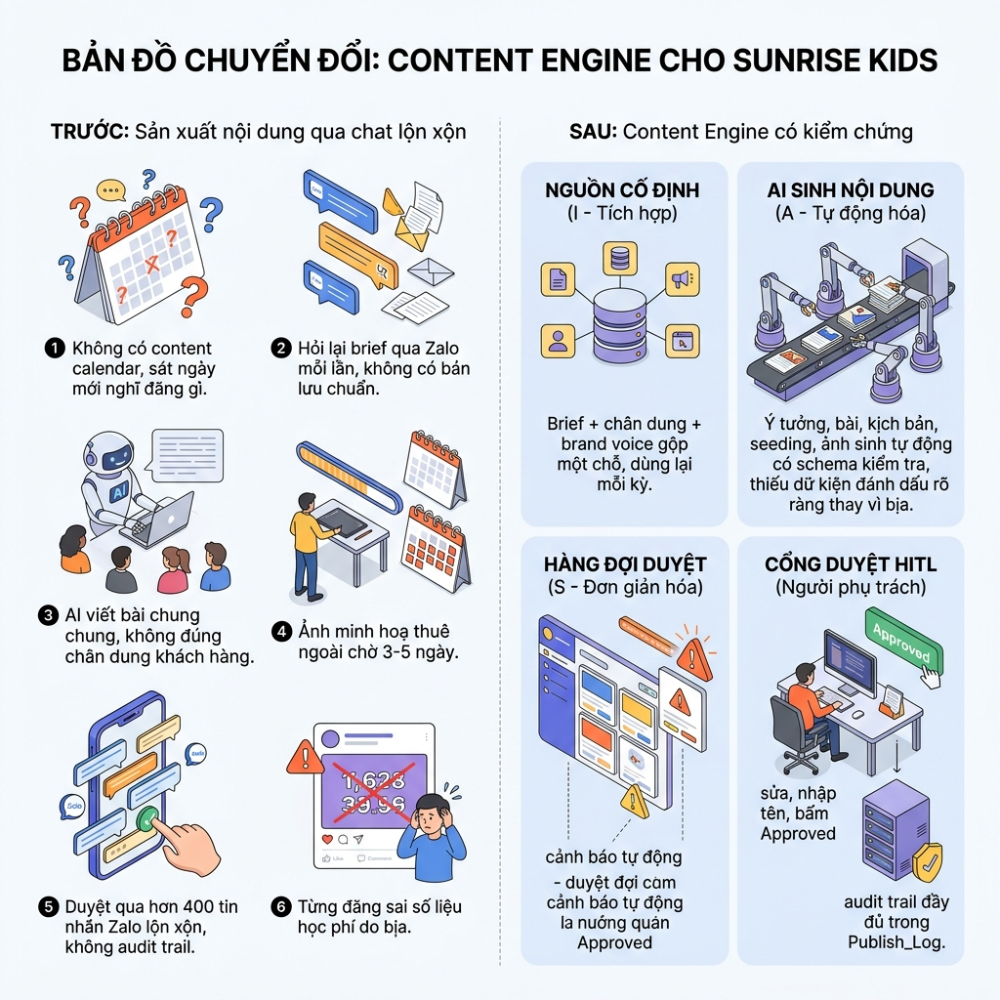

# W2 — Workflow Design: As-is → ESIA To-be

> Input: `01-usecase-matrix.md`. As-is nguồn sự thật duy nhất: `../../luong-nghiep-vu.md` (7 bước nghiệp vụ gốc, không rút gọn). To-be map vào chuỗi thật `../../lab.md` TH1→TH2→TH3→TH4a→TH4b.
> Output feeds W3 (`03-hardening.md`).

> Ảnh tái sử dụng từ `v2.0-workflow-mindset/lab_6/output/` (xem `05-image-prompt.md`) — 4 cột phải khớp đúng ESIA (Integrate/Automate/Simplify/HITL) minh hoạ ở mục 2 bên dưới. Không vẽ bước 5/7 (đã cắt khỏi to-be) — khớp đúng phạm vi mục 3.

## 1. As-is — 7 bước (nguyên bản từ `luong-nghiep-vu.md`)

| # | Bước | Người thực hiện | Input | Output | Điểm nghẽn / Lỗi lặp |
|---|---|---|---|---|---|
| 1 | Lập kế hoạch nội dung theo kỳ | Chủ doanh nghiệp / trưởng phòng marketing | Mục tiêu kinh doanh kỳ (tuyển sinh, giữ chân...), ngân sách, lịch mùa vụ | Content calendar (chủ đề, kênh, tần suất, ngày) | Không có content calendar chính thức — sát ngày mới nghĩ đăng gì, dễ bỏ lỡ mùa tuyển sinh. |
| 2 | Lên brief cho từng bài/chiến dịch | Người phụ trách content | Content calendar + insight thật từ CSKH/sales | Brief cụ thể (bán gì, cho ai, mục tiêu truyền thông) | Viết lại từ đầu mỗi kỳ qua tin nhắn Zalo, không có bản lưu chuẩn về chân dung khách hàng. |
| 3 | Sản xuất nội dung theo kênh | Người phụ trách content + Designer/video editor (song song) | Brief | Bài viết + hình ảnh/video mỗi kênh | Nội dung AI/tay viết chung chung không đúng chân dung; TikTok cần quay+dựng thật tốn nhiều giờ; ảnh thuê ngoài chờ 3-5 ngày. |
| 4 | Duyệt nội bộ | Chủ doanh nghiệp | Bản nháp bài + hình ảnh | Bản đã duyệt / yêu cầu sửa | Thường không phải cổng hình thức — qua Zalo/Slack lộn xộn (có thể 400+ tin nhắn lẫn nội dung/ảnh/chuyện khác), không audit trail, không rõ ai duyệt bản nào khi nào. |
| 5 | Lên lịch & đăng bài | Người phụ trách content | Nội dung đã duyệt | Bài xuất hiện đúng giờ trên Fanpage/TikTok | Đăng tay từng bài, có kỳ quên đúng khung giờ vàng. |
| 6 | Hỗ trợ lan toả sau khi đăng | Người phụ trách content / CSKH | Bài vừa đăng | Comment mồi (seeding) + trả lời comment thật | Seeding nghĩ vội trước giờ đăng, giọng không nhất quán; trực page là việc liên tục cần người thật theo dõi hàng giờ/ngày. |
| 7 | Đo lường & rút kinh nghiệm | *(không ai làm)* | Dữ liệu reach/tương tác/lead từ bài đã đăng | Bài học cho content calendar kỳ sau | Không ai tổng hợp — mỗi kỳ lại đoán mò lại từ Bước 1, không đóng được vòng lặp. |

> Nguồn: `../../luong-nghiep-vu.md` — tài liệu nghiệp vụ gốc, giữ nguyên 7 bước, không rút gọn.

## 2. To-be — ESIA (chỉ trong phạm vi lab: Bước 2–4 của as-is → TH1→TH2→TH3→TH4a→TH4b)

| Bước to-be | E/S/I/A | Chi tiết tối ưu & HITL | Ai làm | Nhánh automation |
|---|---|---|---|---|
| Chuẩn hoá nguồn (brief + chân dung + brand voice + spec kênh) | **I** | Gộp thành 1 bộ nguồn cố định dùng lại mỗi kỳ thay vì hỏi lại qua Zalo mỗi lần (`templates/product-brief-sunrise-kids.md`, `chan-dung-khach-hang.md`, `brand-voice.md`, `channel-format-spec.md`) | AI soạn nháp brief mới từ bộ nguồn (bài tập về nhà), Người xác nhận phạm vi | — |
| Sinh ý tưởng nội dung (TH1) | **I** | AI sinh 5 angle, mỗi angle gắn đúng 1 mã chân dung có thật, phủ ≥2 chân dung — `content-angles.json`. Webhook `/b6/angles` tách RIÊNG khỏi bước viết (rẻ, ~10s, không tốn phí ảnh) — **[HITL nhẹ]** người đọc 5 ý tưởng rồi chọn 1 trước khi cam kết viết đầy đủ, hoặc tự gõ ý tưởng riêng (bỏ qua AI hoàn toàn) | AI hoặc Người | AI Agent (Gemini) → Người chọn |
| Viết bài Fanpage + kịch bản TikTok (TH2) | **A** | AI viết theo spec kênh (Fanpage 120-200 từ, TikTok 4 khối HOOK/PROBLEM/SOLUTION/CTA); thiếu dữ kiện (học phí, ngày khai giảng) → `[cần bổ sung]`, không bịa — `content-draft.json` | AI | AI Agent (Gemini) |
| Sinh seeding + image brief + ảnh (TH3) | **A** | AI sinh 5 seeding (không khen rỗng, ≥2 câu hỏi thật), image brief đủ 9 mục có "không được xuất hiện", ảnh được phép có người/trẻ em (không tham chiếu ai thật, khác ảnh chụp thật) VÀ tối đa 1 dòng tiêu đề/CTA ngắn ≤8 từ (test thật: model render dấu tiếng Việt đúng) — `content-assets.json` | AI | AI Agent → gọi API sinh ảnh |
| Ghi hàng đợi duyệt (TH4a lớp 4) | **A** | n8n ghi 1 dòng `Content_Queue`, Status mặc định `Needs Review`, kèm URL ảnh + seeding | n8n | n8n |
| Duyệt nội dung (TH4b) | **S** | Thay chat lộn xộn bằng **1 cổng duyệt duy nhất** (Vibe App): hiện bài+ảnh+kịch bản+seeding, cảnh báo tự động (không tự sửa, không chặn) chỗ `[cần bổ sung]`/từ cấm brand-voice. **[HITL bắt buộc]** Người phụ trách sửa trực tiếp nếu cần, bắt buộc điền tên người duyệt, bấm Approved/Needs Review | Người | Vibe-coded App |
| Ghi nhận quyết định (webhook `/b6/approve`) | **A** | n8n nhận quyết định qua `$json.body.xxx`, cập nhật `Content_Queue`; nếu Approved → ghi `Publish_Log` (Log ID, người duyệt, ngày) | n8n | n8n |

**HITL note (tương đương BR-W2, viết lại đúng cho buổi 6):** Quyết định "Approved" LUÔN thuộc người phụ trách marketing — workflow chỉ đề xuất + cảnh báo. Đây **mạnh hơn** quy tắc HITL của buổi 4: ở đây không hề tồn tại đường tắt tự động ra công chúng — không có trạng thái `Published`, không có node/nút đăng bài, dù chỉ là đề xuất kỹ thuật (`../../lab.md` §5, `../../prompts/custom-input-prompt.md` "Ba chỗ đừng đụng"). TH2-TH3 (viết bài, seeding, ảnh) không cần HITL từng bước vì được kiểm bằng schema + nghiệm thu văn phong tất định (`giao_trinh/scripts/validate-b6-artifacts.py`) trước khi tới người — nhưng KHÔNG thay thế cổng duyệt cuối.

> Lý do đổi hướng thiết kế TH1 (2026-08-09) so với bản đầu: xem `../process/02-changelog.md`.

## 3. Phạm vi bị cắt — ghi rõ, không giả vờ đã thiết kế

| Bước as-is | Vì sao KHÔNG có trong to-be trên | Xử lý |
|---|---|---|
| 5 — Lên lịch & đăng bài | Chủ đích của lab: "Buổi học dừng ở `Approved`, không đăng bài thật" (`../../lab.md` §5) | Ghi nhận là **mở rộng giai đoạn sau** trong `06-leadership-deck.md`, không đưa vào hardening/mermaid ở package này |
| 6 (phần trực page) | Việc liên tục cần người thật theo dõi hàng giờ/ngày — không phải bài toán tự động hoá một lần | Seeding (phần automatable của bước 6) đã đưa vào TH3; phần trực page giữ nguyên là việc của người |
| 7 — Đo lường & rút kinh nghiệm | Hiện "không ai làm" ở as-is; cần dữ liệu chạy thật một thời gian, phụ thuộc API nền tảng — ngoài phạm vi 120 phút của lab | Ghi nhận là **mở rộng giai đoạn sau**, đề xuất ở leadership deck, không bịa số liệu đo lường chưa có |
