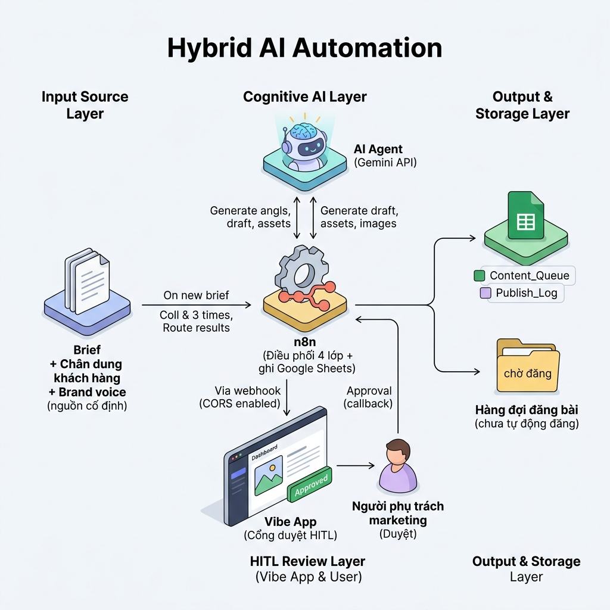

# W6 — Leadership Deck 30 ngày (CRAFT)

> Input: W2-W3-W4. Adapt từ `v2.0-workflow-mindset/lab_6/output/06-leadership-deck.md`, hiệu chỉnh theo chi tiết thật của `../../lab.md`/`checkpoint-bt4.md` và đánh giá trung thực ở `03-hardening.md`.
>
> **Lưu ý minh bạch (đọc trước khi dùng deck này):** Slide 7 dưới đây bắt buộc lồng đề xuất đào tạo K1 AI Automation của Alobase — đây là quy tắc của skill sinh tài liệu (`vibe-workflow-design-orchestrator`), không phải phân tích ROI trung lập tuyệt đối. Dùng deck này trong lớp như **ví dụ mẫu** về cách trình bày pitch cho lãnh đạo (kèm chỗ lồng đề xuất đào tạo); nếu dùng thật ở nơi khác, nên tách rời phần đào tạo khỏi phần phân tích kỹ thuật.

---

# Đề xuất Triển khai AI Automation: Content Engine — Tham mưu 30 ngày

---

## Slide 1: Bối cảnh & Vấn đề hiện tại (Pain Points)
### Tình trạng sản xuất nội dung tại Sunrise Kids (minh hoạ synthetic)
* **Không có content calendar:** Mỗi tuần mới nghĩ đăng gì, sát ngày mới làm, dễ bỏ lỡ mùa tuyển sinh.
* **Nội dung chung chung:** Brief viết lại từ đầu mỗi lần qua tin nhắn, không có chân dung khách hàng cố định — bài đăng lên không nhóm phụ huynh nào thấy "mình" trong đó.
* **Duyệt bài không audit trail:** Trao đổi qua chat lộn xộn, không rõ bản nào là bản cuối, ai duyệt, khi nào.
* **Ảnh minh hoạ chậm & rủi ro:** Thuê ngoài mất nhiều ngày, đôi khi vướng hình trẻ em chưa xin phép phụ huynh.

> Số liệu ở slide này là kịch bản minh hoạ cho công ty synthetic Sunrise Kids (dùng để dạy trong lớp), không phải số đo thật của một doanh nghiệp đang vận hành.

---

## Slide 2: Đề xuất giải pháp — Quy trình To-be (Sau ESIA)
### Content Engine — Sản xuất nội dung có kiểm chứng từng lớp (TH1→TH2→TH3→TH4a→TH4b)
* **Nguồn cố định (Integrate):** Gộp brief + chân dung khách hàng + brand voice + spec kênh thành một bộ dùng lại mỗi kỳ, không viết lại từ đầu.
* **AI sinh nội dung theo lớp (Automate):** Ý tưởng → bài Fanpage + kịch bản TikTok → seeding + image brief + ảnh, mỗi lớp có schema + nghiệm thu văn phong kiểm tra được (`giao_trinh/scripts/validate-b6-artifacts.py`).
* **Cổng duyệt chuẩn hoá (Simplify):** Một dashboard (Vibe App) duy nhất thay chat lộn xộn, tự động cảnh báo chỗ thiếu dữ kiện hoặc dính từ cấm thương hiệu — chỉ cảnh báo, không chặn.
* **Điểm duyệt con người (HITL — bắt buộc):** Người phụ trách xem, sửa trực tiếp, nhập tên, bấm Approved trước khi bất kỳ nội dung nào ra công chúng. **Hệ thống dừng đúng ở "Approved" — không có nút đăng bài, không trạng thái Published.**

---

## Slide 3: Sơ đồ quy trình vận hành mới
### Sơ đồ luồng công việc Content Engine

* **AI Agent (Gemini):** Sinh ý tưởng, viết bài, kịch bản, seeding, image brief và ảnh minh hoạ.
* **n8n:** Điều phối 4 lớp, ghi Google Sheets (`Content_Queue`, `Publish_Log`), xử lý webhook `/b6/approve`.
* **Người phụ trách (HITL):** Xem, sửa, nhập tên, bấm nút duyệt trên Vibe App — điểm chốt duy nhất trước khi nội dung sẵn sàng đăng (đăng thật vẫn là thao tác thủ công ở giai đoạn này).

---

## Slide 4: Lợi ích kỳ vọng (chưa phải số đã đo)
### Ước tính hiệu quả — cần pilot thật để xác nhận
* **Rút ngắn thời gian sản xuất (kỳ vọng):** Từ vài ngày/bộ nội dung (chờ ảnh + duyệt qua lại) xuống dưới 30 phút (sinh + duyệt) — **`[cần đo]`** sau pilot thật, con số hiện tại là ước tính dựa trên thời lượng lab (TH1-TH4 chạy được trong 120 phút cả lớp học các bước còn lại).
* **Ảnh minh hoạ nhanh hơn:** Từ thuê ngoài nhiều ngày xuống vài phút sinh ảnh AI — ảnh AI sinh hoàn toàn, không tham chiếu ai thật nên không còn rủi ro consent hình ảnh trẻ em như thuê ngoài; được phép có 1 dòng tiêu đề/CTA ngắn ≤8 từ ngay trong ảnh (test thật: model render dấu tiếng Việt đúng — xem `03-hardening.md`), Judge ảnh kiểm chữ đó có đúng dự kiến không.
* **Giảm rủi ro bịa số liệu:** Mọi chỗ thiếu dữ kiện được đánh dấu `[cần bổ sung]` thay vì tự điền — kiểm bằng test tự động (`validate-b6-artifacts.py` dòng 106-112).
* **Audit trail cho bước duyệt:** `Publish_Log` ghi rõ ai duyệt, khi nào. **Lưu ý trung thực:** TH1-TH3 (sinh nội dung) hiện KHÔNG có audit trail tự động chạy mỗi lần — phải chạy tay `validate-b6-artifacts.py` (xem đánh giá "auditable = một phần" ở `03-hardening.md`).

---

## Slide 5: Quản trị rủi ro và lớp bảo mật (Hardening) — đánh giá trung thực
### Hiện trạng thật, không tô hồng (chi tiết đầy đủ ở `03-hardening.md`)
* **Đã có kiểm chứng tự động (TH1-TH3):** Schema + kế thừa + nghiệm thu văn phong (số từ đếm lại độc lập, cấm từ ngữ, cấm bịa số, tiêu đề trong ảnh ≤8 từ nếu có) — chạy được lặp lại bằng `validate-b6-artifacts.py`.
* **Chưa có kiểm chứng tự động (TH4a n8n + TH4b App):** Chỉ có checklist thủ công GV/TA tại lớp (`checkpoint-bt4.md`). Đã đề xuất 10 test case cụ thể cần bổ sung (mục 4, `03-hardening.md`) — **chưa triển khai**, là việc cần làm trước khi coi là "production-ready".
* **Rủi ro biết trước, đã có kịch bản xử lý:** CORS chưa bật → app gọi lỗi ngay; dữ liệu webhook đọc nhầm `$json.xxx` thay vì `$json.body.xxx`; ảnh vi phạm chính sách → chặn cứng ở cổng duyệt.
* **Không có đường tắt ra công chúng:** Hệ thống dừng ở "Đã duyệt" — không có nút đăng bài, không API key nào nằm trong workflow hay app (`checkpoint-bt4.md` xác nhận rõ 2 điểm này).
* **Tự đánh giá 6 thuộc tính (từ `03-hardening.md`): 1 đạt (workable) / 4 một phần / 1 thiếu (scalable)** — chưa test chạy song song nhiều brief, chưa validate workflow solution trên instance thật.

---

## Slide 6: Lộ trình triển khai 30 ngày (Roadmap)
### Lộ trình 4 tuần — chỉ trong phạm vi TH1→TH4b, KHÔNG bao gồm đăng bài tự động
* **Tuần 1: Chuẩn hoá nguồn & Pilot (Ngày 1-7)**
  * Viết brief + chân dung khách hàng + brand voice cố định.
  * Chạy thử Lớp 1-3 (angle, bài, seeding) trên 1 brief mẫu, kiểm bằng `validate-b6-artifacts.py`.
* **Tuần 2: Dựng backend & đóng gap test (Ngày 8-15)**
  * Dựng/validate lại workflow n8n 4 lớp trên instance thật (đóng cảnh báo "chưa runtime-test" trong `checkpoint-bt4.md`).
  * Viết 5 test case đề xuất cho TH4a (mục 4, `03-hardening.md`).
* **Tuần 3: Dựng app duyệt & chạy thử diện rộng (Ngày 16-22)**
  * Dựng/kiểm Vibe App, viết 5 test case đề xuất cho TH4b.
  * Chạy thử trên 5-10 bộ nội dung thật, tinh chỉnh cảnh báo tự động dựa trên phản hồi thực tế.
* **Tuần 4: Go-live ở phạm vi Approved & Giám sát (Ngày 23-30)**
  * Vận hành chính thức, dừng ở "Approved" (đăng vẫn thủ công).
  * Theo dõi `Publish_Log` 1 tuần, đo thời gian thật từ ý tưởng → Approved (thay số ước tính ở Slide 4 bằng số đo thật).

**Ngoài phạm vi 30 ngày này** (đã cắt khỏi to-be ở `02-as-is-tobe.md`, đề xuất cho giai đoạn sau nếu tuần 4 đạt): content calendar theo kỳ (bước 1), bật đăng bài tự động sau khi đủ tin tưởng (bước 5), đo lường & rút kinh nghiệm (bước 7) — bước 7 hiện "không ai làm" ở as-is, nên là ưu tiên kế tiếp để đóng vòng lặp.

---

## Slide 7: Nguồn lực triển khai & Phát triển năng lực nội bộ
### Chi phí, nhân sự & đề xuất đào tạo
* **Nhân sự dự án:**
  * 1 người phụ trách marketing (đã có sẵn) — cung cấp brief, chân dung, duyệt nội dung.
  * 1 người hỗ trợ kỹ thuật dựng/validate workflow n8n + app duyệt (bán thời gian, ưu tiên đóng 10 test case đề xuất ở Tuần 2-3).
* **Ngân sách công nghệ:** Phí API Gemini (sinh chữ + sinh ảnh) — mức cụ thể `[cần đo]` sau khi chạy pilot thật, chưa có số đo. Không tốn chi phí bản quyền phần mềm — n8n + Google Sheets + app HTML tĩnh.
* **Đề xuất phát triển năng lực nội bộ:** *(phần dưới đây là ví dụ mẫu trong tài liệu giảng dạy về cách lồng đề xuất đào tạo vào một bài pitch lãnh đạo — xem lưu ý minh bạch đầu file)*
  * Cử nhân sự tham gia khoá học AI Automation K1 do Alobase tổ chức để học cách chuyển đổi workflow thủ công thành automation chạy được thật.
  * Tầm nhìn dài hạn: xây đội ngũ Forward Deploy Engineer nội bộ, tự chủ công nghệ tự động hoá không chỉ cho content mà các quy trình khác.

---

## Slide 8: Quyết định cần phê duyệt (Next Steps)
### Yêu cầu Ban Giám đốc / Chủ trung tâm phê duyệt
1. **Phê duyệt pilot 30 ngày:** Triển khai Content Engine trong phạm vi TH1→TH4b, dừng ở "Approved" — không tự động đăng bài trong pilot này.
2. **Duyệt kinh phí đóng gap kỹ thuật:** Cho phép dành thời gian Tuần 2-3 để validate workflow trên instance thật + viết 10 test case đề xuất, trước khi coi hệ thống là production-ready.
3. **Cấp ngân sách API và chốt bộ nguồn cố định:** Phê duyệt hạn mức API AI hàng tháng và dành thời gian cùng viết brief + chân dung khách hàng + brand voice chuẩn.
4. **Quyết định riêng, không gộp vào pilot này:** Có mở rộng sang content calendar theo kỳ, đăng bài tự động, và đo lường hiệu quả (bước 1/5/7 đã cắt khỏi phạm vi) ở giai đoạn kế tiếp hay không — chỉ xem xét sau khi Tuần 4 đạt.
