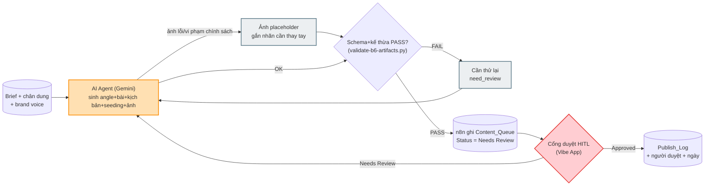

# Workflow Design Doc — Content Engine (Buổi 6)

> Design Doc 7 phần — ráp từ W2-W6. Nguồn sự thật: `../../lab.md` (lab handout B6), `../../luong-nghiep-vu.md` (as-is gốc).
> Tác giả: Giang (GV) · Phòng ban: Marketing/Content · Use-case (từ W1): Content Engine 3 lớp có kiểm chứng + cổng duyệt HITL (TH1→TH4b).
> Tư duy mới B6: **Hybrid Architecture (n8n + AI Agent + Vibe App) + Schema kế thừa + Cổng duyệt dừng cứng ở Approved**.

---

## 1. Hiện trạng (as-is)
*(Từ W2 — nguyên bản 7 bước, không rút gọn)*

| # | Bước | Người thực hiện | Input | Output | Điểm nghẽn / Lỗi lặp |
|---|---|---|---|---|---|
| 1 | Lập kế hoạch nội dung theo kỳ | Chủ doanh nghiệp / trưởng phòng marketing | Mục tiêu kinh doanh kỳ, ngân sách, lịch mùa vụ | Content calendar | Không có content calendar chính thức — sát ngày mới nghĩ đăng gì. |
| 2 | Lên brief cho từng bài/chiến dịch | Người phụ trách content | Content calendar + insight CSKH/sales | Brief cụ thể | Viết lại từ đầu mỗi kỳ qua Zalo, không bản lưu chuẩn chân dung khách hàng. |
| 3 | Sản xuất nội dung theo kênh | Content + Designer/video editor (song song) | Brief | Bài + hình/video mỗi kênh | Nội dung chung chung không đúng chân dung; TikTok cần quay+dựng thật tốn giờ; ảnh thuê ngoài chờ nhiều ngày. |
| 4 | Duyệt nội bộ | Chủ doanh nghiệp | Bản nháp bài + ảnh | Duyệt / yêu cầu sửa | Không cổng hình thức — Zalo/Slack lộn xộn, không audit trail. |
| 5 | Lên lịch & đăng bài | Content | Nội dung đã duyệt | Bài xuất hiện đúng giờ | Đăng tay từng bài, có kỳ quên giờ vàng. |
| 6 | Hỗ trợ lan toả sau khi đăng | Content / CSKH | Bài vừa đăng | Seeding + trả lời comment thật | Seeding nghĩ vội giọng không nhất quán; trực page là việc liên tục. |
| 7 | Đo lường & rút kinh nghiệm | *(không ai làm)* | Dữ liệu reach/tương tác | Bài học kỳ sau | Không ai tổng hợp — mỗi kỳ đoán mò lại từ đầu. |

**Tổng:** chu trình lặp theo kỳ (tháng/quý), không phải sự kiện rời rạc.

---

## 2. Phân tích ESIA & to-be
*(Từ W2 — chỉ trong phạm vi lab: bước 2-4 của as-is → TH1→TH4b)*

| Bước to-be | E/S/I/A | Chi tiết & HITL | Ai làm | Nhánh automation |
|---|---|---|---|---|
| Chuẩn hoá nguồn | **I** | Gộp brief+chân dung+brand voice+spec kênh thành 1 bộ cố định | AI soạn nháp, Người xác nhận | — |
| Sinh ý tưởng (TH1) | **A** | AI sinh 5 angle, ≥2 chân dung — `content-angles.json` | AI | AI Agent |
| Viết bài+kịch bản (TH2) | **A** | Theo spec kênh; thiếu dữ kiện → `[cần bổ sung]` — `content-draft.json` | AI | AI Agent |
| Sinh seeding+ảnh (TH3) | **A** | 5 seeding + image brief 9 mục + ảnh được phép có người/trẻ em VÀ tối đa 1 dòng tiêu đề ngắn ≤8 từ (test thật: model render dấu tiếng Việt đúng) — `content-assets.json` | AI | AI Agent + API ảnh |
| Ghi hàng đợi (TH4a lớp 4) | **A** | n8n ghi `Content_Queue`, Status mặc định `Needs Review` | n8n | n8n |
| Duyệt nội dung (TH4b) | **S** | 1 cổng duy nhất thay chat lộn xộn. **[HITL bắt buộc]** sửa trực tiếp, nhập tên, bấm Approved/Needs Review | Người | Vibe App |
| Ghi nhận quyết định | **A** | Webhook `/b6/approve` cập nhật `Content_Queue`, ghi `Publish_Log` nếu Approved | n8n | n8n |

**Ký hiệu:** E — Eliminate · S — Simplify · I — Integrate · A — Automate

**HITL note:** Quyết định "Approved" LUÔN thuộc người phụ trách marketing. Không có trạng thái `Published`, không có node/nút đăng bài — mạnh hơn quy tắc HITL của B4 (ở đây không tồn tại đường tắt tự động, dù chỉ đề xuất).

**Phạm vi bị cắt (ghi rõ, không giả vờ đã thiết kế):** Bước 5 (đăng bài), bước 6-phần trực page, bước 7 (đo lường) — ngoài phạm vi lab hiện tại, xem đề xuất mở rộng ở phần 6 và `06-leadership-deck.md`.

---

## 3. Hardening cho production
*(Từ W3 — bảng đầy đủ + cột "Kiểm chứng bằng" ở `03-hardening.md`)*

| Bước to-be | Fallback | Edge case | HITL | Kiểm chứng bằng |
|---|---|---|---|---|
| Sinh ý tưởng (TH1) | Fallback `content-angles-bt1-sample-output.json` | Cả 5 angle dồn 1 chân dung | Không bắt buộc | `validate-b6-artifacts.py` dòng 77-79, 94 |
| Viết bài+kịch bản (TH2) | Fallback `content-draft-sample.json` | `thieu_thong_tin` rỗng nhưng brief thiếu thật | Không bắt buộc ở lớp JSON | dòng 79, 86-93, 99-122 |
| Sinh seeding+ảnh (TH3) | Fallback `content-assets-sample.json`; ảnh lỗi → placeholder | Ảnh không đúng dòng chữ dự kiến (sai/thiếu/thừa/lặp) — không còn cấm người/trẻ em hay cấm chữ hoàn toàn, xem compliance note | Không bắt buộc ở lớp JSON | dòng 125-140 |
| Ghi hàng đợi (TH4a) | CORS/`$json.body`/credential theo `checkpoint-bt4.md` | 2 brief ghi trùng giờ | Không bắt buộc | **KHÔNG CÓ test tự động** — chỉ checklist thủ công |
| Duyệt nội dung (TH4b) | Rescue map App theo `checkpoint-bt4.md` | Mất mạng giữa lúc bấm Approve | **Bắt buộc** nhập tên người duyệt | **KHÔNG CÓ test tự động** — chỉ checklist thủ công |
| Ghi nhận quyết định | Kiểm Post ID trước khi ghi `Publish_Log` (double-submit) | Webhook gọi 2 lần cùng Post ID | Quyết định hoàn toàn thuộc người | **KHÔNG CÓ test tự động** |

**Compliance note:** Không đưa dữ liệu học viên/phụ huynh thật lên AI công cộng; ảnh AI sinh được phép có người/trẻ em (không tham chiếu ai thật, khác ảnh chụp thật cần consent — đổi hướng 2026-08-09); không API key trong workflow/app; `n8n-content-engine-solution.json` **đã validate trên instance thật ngày 2026-08-09** (xem `03-hardening.md` §2 để cập nhật đầy đủ nhất — bảng "Mức độ tin cậy" dưới đây thuộc snapshot cũ hơn, chưa refresh theo lần validate thật này).

**Mức độ tin cậy (trung thực, không lạc quan hoá):** workable đạt · fault-tolerant/observable/idempotent/auditable một phần · scalable thiếu. **Tổng 1 đạt / 4 một phần / 1 thiếu.** Chi tiết lý do + 10 test case đề xuất cho TH4a/TH4b: `03-hardening.md` mục 3-4.

---

## 4. Sơ đồ quy trình mới (Mermaid)
*(Từ W4 — file `04-mermaid.mmd`, 8 node, 1 AI, 1 HITL, 2 fallback)*

---

## 5. Ảnh render workflow
*(Từ W5 — `05-image-prompt.md`)*

 — *tái sử dụng từ `v2.0-workflow-mindset/lab_6/output/` (đã xác nhận khớp nội dung: Content_Queue/Publish_Log/Approved, kiến trúc hybrid n8n+AI Agent+Vibe App). Prompt gốc + fallback mermaid.live: xem `05-image-prompt.md`.*

---

## 6. So sánh Trước & Sau (Before / After)

| | Trước (as-is) | Sau (to-be, phạm vi TH1-TH4b) |
|---|---|---|
| Ý tưởng nội dung | Chung chung, không nhắm chân dung nào | AI sinh 5 angle, mỗi angle gắn 1 chân dung có thật, phủ ≥2 chân dung — kiểm bằng test |
| Duyệt | Zalo/Slack lộn xộn, không audit trail | 1 cổng duy nhất (Vibe App), `Publish_Log` ghi ai duyệt/khi nào |
| Số liệu bịa | Rủi ro đăng sai học phí/ưu đãi | `[cần bổ sung]` bắt buộc khi thiếu, kiểm bằng test (dòng 106-112) |
| Ảnh minh hoạ | Thuê ngoài chậm, rủi ro consent ảnh trẻ em thật | AI sinh nhanh hơn, không tham chiếu ai thật (được phép có người/trẻ em); được phép có 1 dòng tiêu đề ngắn ≤8 từ, kiểm bằng test |
| Thời gian sản xuất | `[cần đo]` (as-is chưa đo chính thức) | `[cần đo]` sau pilot — **chưa có số đo thật**, chỉ ước tính |

> Không có bước "đăng bài" hay "đo lường hiệu quả" trong so sánh này — cả 2 bị cắt khỏi phạm vi to-be (mục 2), xem đề xuất mở rộng ở `06-leadership-deck.md` Slide 6.

---

## 7. Danh sách bước cần tự động hoá
*(Tổng hợp W2-W3)*

| Bước A | Công cụ | Điểm duyệt người (HITL) | Phương án dự phòng |
|---|---|---|---|
| Sinh ý tưởng (TH1) | AI Agent (Gemini) | Không bắt buộc — máy tất định qua schema | Fallback JSON mẫu nếu kẹt >12' |
| Viết bài+kịch bản (TH2) | AI Agent (Gemini) | Không bắt buộc ở lớp JSON | Fallback JSON mẫu |
| Sinh seeding+ảnh (TH3) | AI Agent + API ảnh | Không bắt buộc ở lớp JSON | Ảnh lỗi → placeholder |
| Ghi hàng đợi (TH4a) | n8n Code/HTTP node | Không bắt buộc | Rescue map CORS/`$json.body`/credential |
| Duyệt nội dung (TH4b) | Vibe App | **Bắt buộc** — người phụ trách marketing | Rescue map lỗi mạng/CORS |
| Ghi nhận quyết định | n8n webhook `/b6/approve` | Quyết định thuộc người ở bước trước | Kiểm Post ID chống double-submit |

---

## Nguồn & kế thừa

- Use-case cốt lõi: `esia-usecase.md` (Sunrise Kids, TH1→TH4a→TH4b, không có holdout riêng — khác B4).
- 4 TH chain: `../../lab.md`.
- Downstream: Track A (G6a) = HV build TH1-TH4a-TH4b theo design doc này · Track B (G6b) = HV customize sản phẩm riêng theo `../../prompts/custom-input-prompt.md` · Scoring: `giao_trinh/scripts/validate-b6-artifacts.py` (TH1-TH3) + `checkpoint-bt4.md` (TH4, thủ công).
