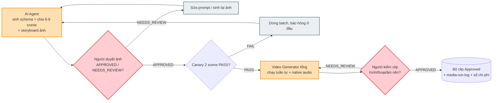
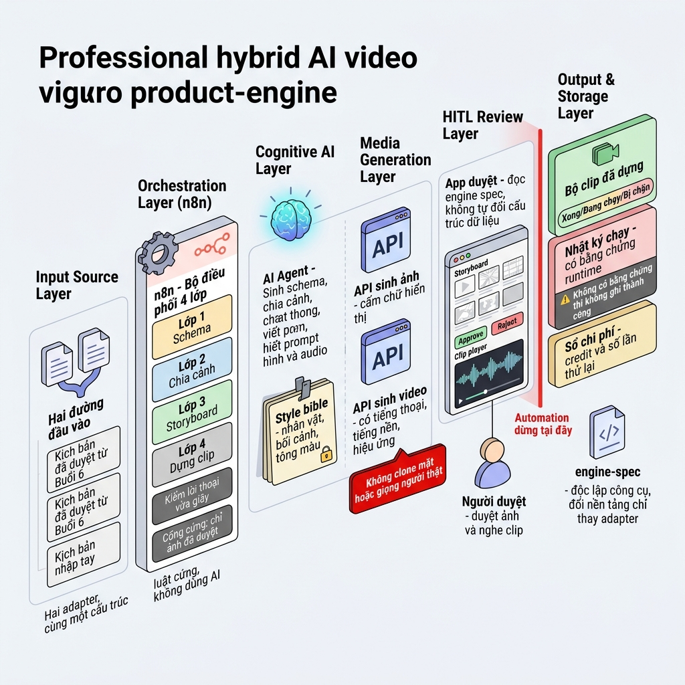

# Workflow Design Doc — AI Video Production (Buổi 7)

> Design Doc 7 phần — ráp từ W2-W6. Nguồn sự thật: `../../lab.md` (lab handout B7), `../../luong-nghiep-vu.md` (as-is gốc).
> Tác giả: Giang (GV) · Phòng ban: Marketing/Content · Use-case (từ W1): Video Production Engine 4 lớp (schema→content artifact→media canary→engine spec), cổng duyệt ảnh + cổng duyệt clip (TH1→TH4B).
> Tư duy mới B7: **Engine độc lập công cụ + cổng cứng duyệt ảnh trước khi tốn credit video + kỷ luật `runtime_evidence`**.

---

## 1. Hiện trạng (as-is)

*(Từ W2 — nguyên bản 7 bước, không rút gọn)*

| # | Bước                          | Người thực hiện                          | Input                             | Output                      | Điểm nghẽn / Lỗi lặp                                                                                                |
| - | ------------------------------- | -------------------------------------------- | --------------------------------- | --------------------------- | ------------------------------------------------------------------------------------------------------------------------ |
| 1 | Nhận kịch bản đã duyệt    | Content lead → Đạo diễn/dựng storyboard | `content-draft.json` (B6)       | Kịch bản input cố định | Ranh giới bàn giao bị phá — người dựng sau tự sửa lời thoại.                                                 |
| 2 | Storyboard hóa                 | Đạo diễn/người dựng storyboard         | Kịch bản + ý định hình ảnh | Storyboard, style bible     | SME nhỏ không có đạo diễn riêng — bước này thường bị bỏ qua hoàn toàn.                                  |
| 3 | Chuẩn bị & Quay               | Quay phim/diễn viên                        | Storyboard đã chốt             | Footage thô                | Không đủ ngân sách thuê đội quay → suy biến thành gõ thẳng prompt vào công cụ AI, retry 4-6 lần/cảnh.  |
| 4 | Dựng hậu kỳ                  | Editor                                       | Footage thô + audio              | Bản dựng có hình+tiếng | Mỗi cảnh một nhân vật/bối cảnh/tông màu khác nhau; lời thoại không kịp thời lượng chỉ lộ ra ở đây. |
| 5 | Duyệt nội bộ                 | Chủ doanh nghiệp                           | Bản dựng                        | Approved/yêu cầu sửa     | Góp ý ở mức cả video, không mức từng cảnh → sửa gì cũng thành dựng lại.                                  |
| 6 | Xuất bản & đăng             | Content lead                                 | Video đã duyệt                 | Video trên TikTok/Fanpage  | Đăng tay, có kỳ quên giờ vàng.                                                                                    |
| 7 | Đo lường & rút kinh nghiệm | *(không ai làm)*                         | View/completion/share             | Bài học kỳ sau           | Không ai tổng hợp — lặp lại lỗi cũ.                                                                              |

---

## 2. Phân tích ESIA & to-be

*(Từ W2 — chỉ trong phạm vi lab: bước 1-5 của as-is → TH1→TH4B)*

| Bước to-be                                 | E/S/I/A        | Chi tiết & HITL                                               | Ai làm           | Nhánh automation |
| -------------------------------------------- | -------------- | -------------------------------------------------------------- | ----------------- | ----------------- |
| Chuẩn hoá 2 đường input                 | **I**    | B6_APPROVED/MANUAL → cùng`video-script.json`               | AI+Người        | n8n (2 adapter)   |
| Sinh 3 schema+sample (TH1)                   | **A**    | Prompt sinh, không viết tay —`additionalProperties:false` | AI Agent          | AI Agent          |
| Chia 6-9 scene (TH2)                         | **A**    | Thay storyboard thủ công; mỗi scene có`scene_id`         | AI Agent          | AI Agent          |
| Style bible + voice bible dùng chung        | **S**    | 1 file nhân vật/bối cảnh/tông màu/9:16 + 1 mô tả giọng DUY NHẤT dùng lặp lại mọi clip (không đổi giọng theo scene) | n8n               | n8n (Set node)    |
| Sinh storyboard+ảnh (TH2/TH3)               | **A**    | `image_prompt` cấm chữ, cấm mô tả người thật         | AI Agent+API      | AI Agent          |
| **Duyệt kịch bản chi tiết: dialogue + video_prompt + negative_prompt từng clip** | **HITL** | Cổng MỚI, tách khỏi duyệt ảnh — bắt lỗi lời thoại/chỉ dẫn narration sai TRƯỚC khi tốn credit sinh ảnh/video; kỹ thuật enforce bằng flag `script_approved` chặn ở cổng sinh ảnh | **Người** | App duyệt (hoặc n8n IF kiểm flag) |
| **Duyệt ảnh: APPROVED/NEEDS_REVIEW** | **HITL** | AI không tự APPROVE; cổng chặn chi phí quan trọng nhất  | **Người** | App duyệt        |
| Cổng cứng ảnh→clip                       | **A**    | Approved→`READY_TO_GENERATE`; chưa duyệt→`BLOCKED`     | n8n               | n8n (IF)          |
| Canary 2 scene                               | **A**    | Báo trước số lượt dự kiến; chưa PASS không batch     | n8n+Người       | n8n               |
| Video Generator tổng (TH3)                  | **I**    | Chạy tuần tự, audio đủ 8 trường                         | n8n+API video     | n8n (Loop)        |
| **Duyệt clip: hình/thoại/âm nền** | **HITL** | Máy không tự chấm được                                  | **Người** | App duyệt        |
| Đóng gói engine spec (TH4A)               | **S**    | Độc lập công cụ, đổi công cụ chỉ thay adapter        | AI Agent          | AI Agent          |
| App node-based (TH4B)                        | **S**    | Đọc engine spec, không tự đổi data contract              | AI Agent          | App vibe coding   |

**HITL note:** Ba cổng người quyết định không thể bỏ qua — duyệt kịch bản chi tiết trước khi tốn credit sinh ảnh, duyệt ảnh trước khi dựng clip, và nghe/xem clip trước khi coi là xong (cổng thứ 3 gọn lại thành 1 bước nếu công cụ sinh audio gốc kèm video — không còn cổng "duyệt audio riêng" như bản thiết kế cũ giả định TTS tách rời). Bước 6-7 không nằm trong to-be — engine kết thúc ở bộ clip+run log.

**Phạm vi bị cắt:** Bước 6 (đăng), Bước 7 (đo lường), clone mặt/giọng người thật — xem lý do đầy đủ ở `02-as-is-tobe.md` mục 3.

---

## 3. Hardening cho production

*(Từ W3 — bảng đầy đủ ở `03-hardening.md`)*

| Bước to-be           | Fallback                                                 | Edge case                                                      | HITL                                              | Kiểm chứng bằng                                |
| ---------------------- | -------------------------------------------------------- | -------------------------------------------------------------- | ------------------------------------------------- | ------------------------------------------------- |
| Sinh schema (TH1)      | `checkpoints/reference-schemas/`                       | Schema khoá tiêu chí nghệ thuật bằng regex               | Không                                            | Checklist thủ công`checkpoint-bt1.md`         |
| Content artifact (TH2) | `fallback-inputs/video-script-sample.json`             | Scene/frame/clip mồ côi                                      | Không bắt buộc ở lớp JSON                    | Checklist thủ công`checkpoint-bt2.md`         |
| Media canary (TH3)     | Clip fallback nhưng ghi`NOT_RUNTIME_TESTED`           | Ảnh API lỗi/quota                                            | **Bắt buộc** duyệt ≥1 ảnh trước clip | Checklist thủ công`checkpoint-bt3.md`         |
| Engine spec (TH4A)     | Ghi`BLOCKED` nếu canary chưa tạo được clip thật | Mô tả tính năng chưa chạy thật →`NOT_RUNTIME_TESTED` | Có — người rà trước khi chốt              | Checklist thủ công`checkpoint-bt4.md` mục 4A |
| App hỗ trợ (TH4B)    | Ưu tiên 4A, không cắt engine spec                    | Hardcode key/pseudo API                                        | Kế thừa 2 cổng HITL TH3                        | Checklist thủ công`checkpoint-bt4.md` mục 4B |

**Compliance note:** Không clone mặt/giọng người thật khi chưa consent văn bản; không logo/nhạc/hình thiếu quyền; ảnh trẻ em kế thừa nguyên tắc B6 (chỉ AI sinh, style reference synthetic); chữ không sinh trong ảnh; `runtime_evidence` bắt buộc mới được ghi `SUCCESS`.

**Mức độ tin cậy:** 2 đạt (auditable, workable) / 4 một phần (fault-tolerant, observable, idempotent, scalable) — **chưa có lần chạy pilot thật ngoài giờ lab được ghi nhận**, khác B6 đã validate trên instance thật. Chi tiết: `03-hardening.md` mục 3.

---

## 4. Sơ đồ quy trình mới (Mermaid)

*(Từ W4 — file `04-mermaid.mmd`, 8 node, 2 AI, 2 HITL, 2 fallback)*

---

## 5. Ảnh render workflow

*(Từ W5 — `05-image-prompt.md`)*

 — *kiến trúc hybrid n8n (điều phối 4 lớp) + AI Agent (schema/scene/storyboard) + App duyệt (HITL ảnh + clip), dùng cho Slide 3 của `06-leadership-deck.md`.*

 — *so sánh Trước (đốt credit mù) / Sau (Engine 4 lớp + cổng cứng duyệt ảnh), dùng làm ảnh nền cover Slide 1 của `06-leadership-deck.md`.*

 — *4 panel kể chuyện hành trình kịch bản → video, ảnh phụ dễ hiểu cho người không kỹ thuật.*

Cả 3 ảnh đã render, prompt gốc + ghi chú đối chiếu: xem `05-image-prompt.md`.

---

## 6. So sánh Trước & Sau (Before/After)

|                                      | Trước (as-is)                      | Sau (to-be, phạm vi TH1-TH4B)                   |
| ------------------------------------ | ------------------------------------ | ------------------------------------------------ |
| Xem trước trước khi tiêu credit | Không có — nhảy thẳng vào clip | Storyboard ảnh cho toàn bộ 6-9 cảnh          |
| Continuity giữa cảnh               | Mỗi cảnh một thế giới           | Style bible dùng chung                          |
| Lời thoại vừa thời lượng       | Phát hiện ở khâu ghép           | Kiểm ngay ở lớp kịch bản                    |
| Một clip lỗi                       | Hỏng cả lượt, nản, bỏ dở      | Chỉ hỏng clip đó                             |
| Chi phí                             | Không ai đếm                      | Sổ credit + retry theo scene —`[cần đo]`   |
| Truy vết                            | Không có                           | ID nối`project→scene→frame→clip` + run log |

> Không có bước "đăng" hay "đo lường" trong so sánh này — cả 2 bị cắt khỏi phạm vi to-be, xem `06-leadership-deck.md` Slide 6.

---

## 7. Danh sách bước cần tự động hoá

*(Tổng hợp W2-W3)*

| Bước A                    | Công cụ       | HITL                           | Fallback                                     |
| --------------------------- | --------------- | ------------------------------ | -------------------------------------------- |
| Sinh schema (TH1)           | AI Agent        | Không                         | `checkpoints/reference-schemas/`           |
| Chia scene+storyboard (TH2) | AI Agent        | Không bắt buộc ở lớp JSON | `fallback-inputs/video-script-sample.json` |
| Duyệt ảnh (TH3)           | App duyệt      | **Bắt buộc**           | Checklist`checkpoint-bt3.md`               |
| Sinh clip có audio (TH3)   | n8n/API video   | Duyệt clip bắt buộc         | Clip fallback +`NOT_RUNTIME_TESTED`        |
| Engine spec (TH4A)          | AI Agent        | Người rà trước khi chốt  | —                                           |
| App hỗ trợ (TH4B)         | App vibe coding | Kế thừa 2 cổng TH3          | Nộp master prompt nếu hết giờ            |

---

## Nguồn & kế thừa

- Use-case cốt lõi: `01b-usecase-design.md` tương đương (`v2.0-workflow-mindset/Output_B7/01b-usecase-design.md`) — 8 rủi ro, điểm HITL đầy đủ.
- 5 TH chain: `../../lab.md`.
- Đầu vào: `content-draft.json` (Approved từ Buổi 6) hoặc `../../templates/manual-script-input.md`.
- Scoring: checklist thủ công `../../checkpoints/checkpoint-bt1.md` đến `checkpoint-bt4.md` — B7 chưa có script validate tự động tương đương `validate-b6-artifacts.py`.
